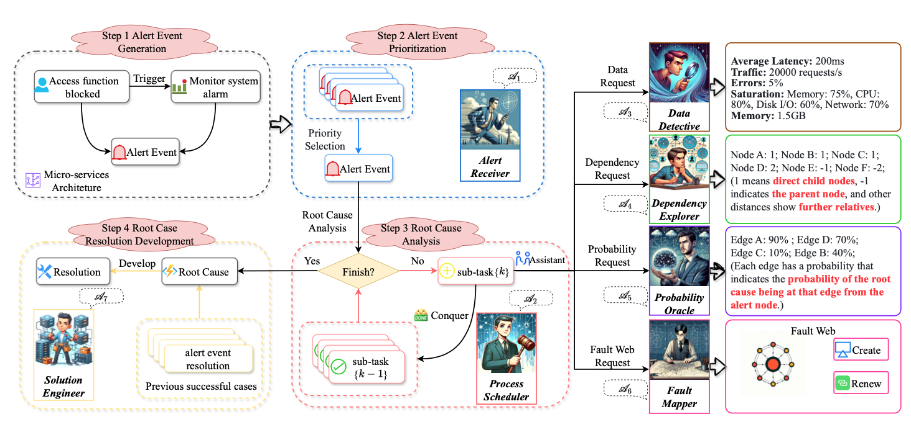

<div align="center">
    <h1>区块链融合Agent应用调研报告</h1>
</div>

<div align="center">
    <h3>摘要</h3>
</div>

本调研报告以“mABC：面向微服务架构根因分析的多智能体区块链启发式协作框架”为核心研究对象，深入探讨了区块链核心理念与人工智能体（AI Agent）技术在复杂系统运维领域的创新融合路径。报告系统分析了微服务架构下根因分析（RCA）面临的严峻挑战，以及现有方法（包括基于大语言模型的方案）在可靠性、可解释性与协作性方面的固有局限。研究发现，mABC 框架通过借鉴区块链的去中心化共识与可追溯性思想，构建了一个由多个专业化 AI Agent 组成的协作系统，有效解决了单一智能体的“幻觉”问题与复杂故障场景下的决策可信度难题。其核心技术贡献在于创造性地设计了 “Agent 工作流” 与 “区块链启发型投票”机制，在保障分析过程高效有序的同时，实现了多智能体间可信、透明决策的形成。本报告通过理论分析、论文剖析与项目实践解读，论证了这种跨领域思想迁移不仅为 AIOps 提供了先进解决方案，更对理解区块链思想的普适性、探索智能体在可信环境下的协作模式具有重要启示。分析结论指出，mABC 代表了从“代码即法律”的静态自动化迈向“协作即共识”的动态自主化的重要一步，为区块链与 AI 的深度融合提供了关键性的范式参考。

**关键词**：区块链；人工智能体；大语言模型；根因分析；微服务架构；多智能体协作；共识机制

<div style="page-break-after: always;"></div>
<div align="center">
    <h3>目录</h3>
</div>
[TOC]
<div style="page-break-after: always;"></div>

# 1. 引言

## 1.1. 研究背景

我们正经历一场由软件定义一切驱动的深度数字化转型，微服务架构（Micro-services Architecture, MSA）已成为构建现代化、云原生应用系统的主导范式。通过将复杂的单体应用解耦为一系列小型、独立、松耦合的服务，该架构赋予了系统前所未有的敏捷性、可扩展性与技术异构包容性，从全球顶级的互联网平台到核心的企业级系统，其背后无不依赖于微服务构建的复杂数字生态。

然而，技术范式演进的红利始终伴随着与之对等的管理复杂度挑战。一个中等规模的微服务系统即可催生出数百个相互调用的服务实例，形成一张高度动态、深度嵌套且充满隐性依赖的服务关系网络。在此环境中，任何一个服务节点的异常都可能沿调用链引发级联式的故障传播，而服务间普遍存在的循环依赖更使得故障根因的诊断过程极易陷入逻辑闭环，难以自拔。传统的监控告警与基于固定规则的诊断方法，在面对这种非线性、高维度的复杂性问题时，日益暴露出响应滞后、覆盖片面与误报频繁的固有缺陷。

为应对这一挑战，智能运维（AIOps）应运而生，致力于引入人工智能技术以增强系统的自感知、自诊断与自恢复能力。其中，根因分析（Root Cause Analysis, RCA）作为定位故障本源、指导修复行动并积累运维知识的核心环节，已成为 AIOps 领域的关键性前沿课题。当前，RCA 技术路径主要围绕基于专家规则的系统、基于统计模型的关联分析以及基于机器学习的模式识别三大方向展开。尽管各有建树，但这些方法在应对微服务环境特有的 “数据孤岛”（指标、日志、链路数据分散）、 “故障传播路径非线性”以及“多因素并发故障纠缠”等难题时，仍显得力不从心。

与此同时，以 大语言模型（LLM）为代表的人工智能技术取得了颠覆性突破。LLMs 通过在海量代码库、技术文档与运维知识上的预训练，不仅掌握了人类语言的复杂语义，更内化了丰富的软件工程领域知识与初步的逻辑推理能力。这使其具备了理解系统架构、解析日志语义、推测故障原因的潜力，仿佛一位不知疲倦的“虚拟运维专家”。然而，将 LLM 直接应用于高可靠要求的生产运维场景，存在几个致命的“阿喀琉斯之踵”：首当其冲的是 “幻觉”问题，即模型可能生成看似合理实则错误的结论；其次是 领域专业性深度不足 ，对特定技术栈的内部机理理解浮于表面；再者是其决策过程如同“黑箱”，缺乏可解释性与可审计性；最后，单一的智能体难以承载复杂故障诊断所需的多维度、跨领域专业知识协同。

因此，当前的核心矛盾与学术前沿聚焦于：如何在不牺牲 LLM 强大泛化与创新能力的前提下，构建一个能够确保结果可靠、过程透明、且能融合多元专业知识的智能分析系统？ 这一问题的解答，亟待跨领域的思想碰撞与技术融合。

## 1.2. 选题意义

本调研选取《mABC: Multi-Agent Blockchain-inspired Collaboration for Root Cause Analysis in Micro-Services Architecture》这篇发表于 EMNLP 2024 Findings 的前沿论文及其对应开源项目作为核心研究对象，具有深远的理论与实践双重意义。

在理论层面，该研究为我们提供了一个绝佳的跨学科思想融合范例。它没有止步于简单应用现有的区块链技术或追求更大的单体模型，而是开创性地进行了 “区块链思想的内化与迁移” 。研究团队敏锐地洞察到，区块链通过密码学与共识算法实现“去中心化信任”的核心思想，与微服务故障诊断中整合多元异构分析以达成可信结论的根本需求之间存在深刻的结构性共鸣。mABC 框架将区块链中的“节点”映射为专业化的 AI Agent，将“交易验证”转化为分析结果的“交叉验证”，将“共识过程”改造为多智能体的“协作决策流程”，将“不可篡改的账本”延伸为分析过程的“全链路可追溯记录”。这种深层次的理念借鉴与机制再造，不仅为解决具体工程问题提供了新工具，更生动展示了计算机科学内部不同分支间思想流动与范式交叉的巨大潜力，对于启发跨学科创新思维具有重要价值。

在实践层面，mABC 框架直面 AIOps 领域最迫切的可靠性痛点，提出了一套系统化的解决方案。它通过“多智能体分工协作”与“区块链式共识投票”两大核心设计，有效应对了 LLM 的幻觉问题，提升了复杂决策的可信度与可解释性。该研究并非停留在理论构想，而是提供了完整的开源实现与详实的实验验证，使其具备了直接的工程参考价值与落地可行性。对于亟需提升运维智能化水平的企业而言，mABC 指明了一条将前沿 AI 研究转化为稳定生产力的可行路径。

对于区块链领域的学习者而言，本选题的意义尤为特殊。它有力地证明了区块链的核心理念——特别是其去中心化协作与可信共识机制——其价值远不止于加密货币。mABC 的成功实践表明，这些思想可以被抽象为一种普适的分布式系统设计哲学，应用于如复杂系统诊断、协同决策支持等更广泛的“无币”或“轻币”场景。这极大地拓展了我们对区块链技术外延与内涵的理解，展现了其作为下一代可信互联网基础设施基础思想的深远影响力。

## 1.3. 调研目标与方法

基于上述背景与意义，本调研报告旨在达成以下核心目标：

1.  **深度解析与评估**：系统、深入地剖析 mABC 框架的设计思想、技术架构、核心算法与实现细节，客观评估其在解决微服务根因分析问题上的有效性、创新性与局限性。
2.  **探索融合范式**：以 mABC 为典型案例，深入研究“区块链思想”与“多智能体 AI”这两种前沿范式进行融合的逻辑、方法与优势，总结可复用的跨领域创新模式。
3.  **引申行业洞察**：结合框架的分析，展望区块链与 AI Agent 技术在智能运维乃至更广阔的产业自动化领域的融合应用前景、潜在挑战与发展趋势。

为实现这些目标，本报告将综合运用以下研究方法：

- **文献研究法**：精读 mABC 核心论文，追溯其引用的相关领域（AIOps、多智能体系统、区块链共识、LLM 应用）的重要文献，构建坚实的理论基础。
- **案例分析法**：将 mABC 框架作为一个完整的技术案例进行拆解，分析其问题定义、解决方案设计、实验验证的全过程。
- **比较分析法**：将 mABC 与传统的 RCA 方法、单一 LLM 应用方案以及其他多智能体框架进行多维度对比，突显其差异化优势与独特价值。
- **实践验证法**：参考其开源项目代码与文档，尝试理解其工程实现，验证其核心主张的可行性，并分析从论文到代码的落地细节。

## 1.4. 分工说明

本报告是小组成员协同研究的成果。具体分工如下：

| 成员 | 负责部分 |
| --- | --- |
| 古振 | 前言 + 总结 |
| 韦世贸 | 理论基础 |
| 毛韩宇 | 论文概述 |
| 刘浩田 | 论文核心技术分析 |
| 王家睿 | 论文结论与效果分析 |
| 张俊峰(组长) | 项目概述与架构设计 + 整合 |
| 吕奎辰 | 核心功能实现与运行效果 |
| 胡永杰 | 分析与评价 |

# 2. 理论基础

## 2.1. 故障传播理论

### 2.1.1. 故障传播机制

微服务架构中的故障传播遵循依赖关系从上游向下游扩散。当某个服务发生故障时，所有依赖该服务的下游服务都可能受到影响，形成级联失效（Cascading Failure）现象。

**故障传播的特点**：

1. 故障从源节点传播到下游节点存在时间延迟，延迟与调用频率、超时设置等因素相关。

2. 故障影响在传播过程中可能逐渐减弱，如通过熔断、降级等机制可以阻断故障传播。

3. 某些情况下，故障影响可能被放大，如请求重试、资源竞争等导致下游服务承受更大压力。

4. 故障可能沿多条路径同时传播，最终在某个节点汇聚，加剧该节点的故障程度。

### 2.1.2. 故障根因分析

故障根因分析（Root Cause Analysis, RCA）旨在识别导致系统故障的根本原因，而非仅仅处理表面症状。在分布式系统中，RCA面临以下挑战：

- 故障现象与根因之间可能存在间接的、多层次的因果关系
- 可观测性数据（日志、指标、追踪）可能存在缺失或延迟
- 大量正常波动和无关告警可能掩盖真正的故障信号
- 快速定位根因对于减少业务损失至关重要

## 2.2. 多智能体系统理论

多智能体系统（Multi-Agent System, MAS）是由多个自主智能体组成的分布式系统，智能体之间通过通信和协作完成复杂任务。

### 2.2.1. 智能体协作机制

多智能体协作通过以下机制实现：

**任务分解与分配**：将复杂任务分解为子任务，根据智能体的能力进行分配。任务分配可以是集中式的（由中央协调者分配）或分布式的（智能体自主竞标）。

**信息共享与通信**：智能体之间通过消息传递交换信息，包括观测结果、推理结论、任务状态等。通信协议定义了消息的格式、语义和交互规则。

**协商与冲突解决**：当智能体之间存在资源竞争或目标冲突时，通过协商机制达成妥协。协商策略包括让步、仲裁、投票等。

**集体决策**：多个智能体通过投票、共识算法等方式做出集体决策，综合不同视角和专业知识。

### 2.2.2. 智能体专业化与分工

在复杂问题求解中，智能体可以根据不同的专业领域进行分工：

**领域专家智能体**：每个智能体专注于特定领域的知识和技能，如数据分析、代码审查、系统监控等。

**角色分工**：智能体承担不同的角色，如协调者、执行者、评审者等，形成组织结构。

**能力互补**：不同智能体的能力相互补充，共同覆盖问题空间的各个方面。

专业化分工的优势在于降低单个智能体的复杂度，提高整体系统的效率和准确性。

## 2.3. 区块链与共识机制理论

### 2.3.1. 区块链基本原理

区块链是一种去中心化的分布式账本技术，通过密码学和共识机制保证数据的不可篡改性和一致性。区块链的核心特征包括：

**去中心化**：没有单一的控制节点，所有节点地位平等，共同维护系统状态。

**透明性**：所有交易记录对网络中的节点可见，保证信息公开透明。

**不可篡改性**：通过哈希链和密码学签名，历史数据一旦写入难以篡改。

**分布式共识**：网络中的节点通过共识算法就数据状态达成一致。

### 2.3.2. 共识机制

共识机制是区块链中节点就账本状态达成一致的协议。常见的共识机制包括：

**工作量证明（Proof of Work, PoW）**：节点通过计算难题竞争记账权，计算能力强的节点更有可能获得记账权。优点是安全性高，缺点是能耗大。

**权益证明（Proof of Stake, PoS）**：根据节点持有的权益（如代币数量）分配记账权，权益越大，被选中的概率越高。相比PoW更节能。

**拜占庭容错（Byzantine Fault Tolerance, BFT）**：通过多轮投票在存在恶意节点的情况下达成共识。适用于节点数量有限、身份已知的联盟链场景。

**委托权益证明（Delegated Proof of Stake, DPoS）**：代币持有者投票选举代表节点，代表节点负责出块和验证。提高了效率但牺牲了部分去中心化程度。

### 2.3.3. 投票与共识算法

投票是分布式系统中实现民主决策的基本机制。在设计投票算法时，投票权重的分配是关键考虑因素，不同节点可以根据其可信度、历史贡献或专业能力被赋予不同的权重。多数决原则是投票决策的基本规则，根据不同的安全性要求，可以设定简单多数、绝对多数或三分之二多数等不同的通过阈值。

# 3. 论文分析

## 3.1. 研究背景

### 3.1.1. 微服务架构的普及与挑战

微服务架构（Micro-services Architecture, MSA）已成为现代云原生系统的核心范式。它将传统单体应用拆解为多个独立部署、松耦合、通过轻量级协议（如 HTTP/gRPC）交互的服务单元。这种设计带来了高可扩展性、快速迭代和故障隔离等优势。

然而，随着服务数量激增（常达数百甚至上千个），系统拓扑变得高度复杂，引发一系列运维难题：

- 故障传播（Fault Propagation）：一个节点的异常（如高延迟、宕机）会通过调用链迅速扩散至上游服务，导致“雪崩效应”；
- 循环依赖（Circular Dependencies）：服务 A → B → C → A 的依赖环路在实际系统中普遍存在，使得传统基于有向无环图（DAG）的分析方法失效；
- 告警泛滥（Alert Storm）：同一根因可能触发多个表层告警，掩盖真实问题源头。

### 3.1.2. 根因分析（RCA）的重要性与难点

根因分析的目标是从大量表层告警中逆向追踪并准确定位引发故障的原始节点或组件。在 MSA 中，RCA 是保障系统稳定性、缩短 MTTR（平均修复时间）的关键环节。

但现有 RCA 方法面临显著瓶颈：

| 方法类型 | 代表工作 | 主要缺陷 |
|----------|--------|--------|
| 基于追踪日志/指标的传统方法 | TraceAnomaly (Liu et al., 2020), MEPFL (Zhou et al., 2019) | 依赖监督训练；难以建模跨服务复杂依赖；对循环依赖处理能力弱 |
| 基于大语言模型（LLM） | Wei et al., 2022a; Kojima et al., 2022; Wei et al., 2022b; Yao et al., 2023 | 存在幻觉（hallucination）风险（生成看似合理但错误的因果链）；缺乏多视角验证机制 |
| 信息聚合型工具 |RCA-Copilot（Chen et al., 2023）; RCAgent（Wang et al., 2023b）; D-Bot (Zhou et al., 2023) | 侧重事件匹配，未深入故障传播路径推理,难以应对幻觉问题、MSA中常见的跨节点故障 |

### 3.1.3. 新兴技术机遇：多智能体 + 区块链思想

- 多智能体系统（Multi-Agent Systems）：可模拟人类专家协作，不同智能体专注不同子任务（如数据收集、依赖分析、概率评估），提升整体分析深度与广度。
- 区块链治理机制：其去中心化、透明投票、共识驱动的特性，可被借鉴用于构建可信的 LLM 决策验证框架，有效抑制幻觉。

---

## 3.2. 研究目标（Research Objectives）

论文旨在构建一个自动化、高精度、可解释且鲁棒的微服务根因分析系统，具体目标如下：

1. 精准识别跨节点故障的根因
   - 能够处理任意复杂依赖拓扑（包括循环依赖）；
   - 不仅定位根因节点，还能还原完整的故障传播路径（如 I → G → D → A）；
   - 支持多种故障类型（网络、存储、CPU、内存、代码异常等）。

2. 生成实用、可操作的修复建议
   - 基于历史成功案例与当前上下文，提供具体、可执行的解决方案（如“增加磁盘吞吐量”、“扩容连接池”）；
   - 解决方案需具备领域合理性，避免 LLM 幻觉导致的无效或危险操作。

3. 解决 LLM 在 RCA 中的核心缺陷
   - 抑制幻觉：通过多智能体交叉验证与投票机制，确保输出内容可靠性；
   - 防止无限推理：针对循环依赖导致的非终止问题，引入硬性步骤限制与标准化任务流程。

4. 构建开放、可复现的研究基准
   - 发布首个面向真实微服务场景的 RCA 数据集——Train-Ticket Dataset；
   - 开源完整框架代码，推动 AIOps 领域发展。

---

## 3.3. 技术概述（Technical Overview）

MABC 框架由四大核心技术模块构成：多智能体架构、Agent Workflow、区块链启发式投票机制和故障网络（Fault Web）。其整体流程如图 2 所示。

### 3.3.1. 多智能体架构（Multi-Agent Architecture）

MABC 定义了 7 个专业化智能体，均基于 LLM（如 GPT-4、Llama-3）实现，各司其职：

| 智能体 | 核心功能 | 输入 | 输出 |
|--------|--------|------|------|
| Alert Receiver (A1) | 告警优先级排序 | 原始告警流 | 最高优先级告警 |
| Process Scheduler (A2) | 任务调度与流程控制 | 告警、子任务结果 | 子任务分配、是否完成判断 |
| Data Detective (A3) | 性能数据采集 | 节点列表、时间窗口 | 结构化指标（延迟、错误率、资源使用率等） |
| Dependency Explorer (A4) | 服务依赖挖掘 | 节点、时间窗口 | 依赖关系图（直接/间接） |
| Probability Oracle (A5) | 故障概率评估 | 节点指标、依赖关系 | 各节点/边的故障概率 |
| Fault Mapper (A6) | 故障网络构建 | 节点+概率 | 可视化 Fault Web（图结构） |
| Solution Engineer (A7) | 修复方案生成 | 根因、Fault Web、历史案例 | 具体操作建议 |

所有智能体平等协作，形成去中心化的 Agent Chain。

### 3.3.2. Agent Workflow：标准化推理流程

为兼顾灵活性与可控性，MABC 设计了统一的智能体执行流程：

- ReAct 模式（Reason + Act）：
  - 适用于需外部工具（如查询数据库、调用 API）的任务；
  - 迭代执行“思考 → 行动 → 观察”循环，直至得出答案；
- Direct Answer 模式：
  - 适用于纯推理任务；
  - 直接基于提示词生成答案。

### 3.3.3. 区块链启发式投票机制（Blockchain-Inspired Voting）

这是 MABC 抑制 LLM 幻觉的核心机制：

#### 3.3.3.1. 投票触发
- 任一智能体生成答案后，其他智能体可**自主决定是否发起投票**；
- 若无人发起，则默认答案可信。

#### 3.3.3.2. 投票规则
- **选项**：For（支持）、Against（反对）、Abstain（弃权）；
- **权重计算**：  
  \[
  w_i = w_c^{(i)} \times w_e^{(i)}
  \]
  - \(w_c\)（贡献指数）：鼓励活跃参与，随时间衰减；
  - \(w_e\)（专业指数）：奖励准确判断，累积不衰减；
  - 两者上限均为 1.5，防止单一智能体垄断话语权。

#### 3.3.3.3. 通过条件
- 支持率 \(s \geq \alpha\)（默认 0.5）；
- 参与率 \(p \geq \beta\)（默认 0.5）；
- 若未通过，原智能体重答。

该机制模拟区块链社区治理，实现“**多数专业意见胜出**”。

### 3.3.4. 故障网络（Fault Web）

- 由 Fault Mapper 动态构建的加权有向图；
- 节点：微服务实例；
- 边权重：表示从某节点传播故障至另一节点的概率；
- 可视化呈现根因位置及传播路径，辅助 Solution Engineer 制定策略。

---

## 3.4. 核心技术与理论

该论文提出的MABC框架通过多智能体协作、标准化工作流以及区块链启发式投票机制，解决了微服务架构中根因分析的复杂性与大语言模型的幻觉问题。本章将深入剖析这三大核心技术模块的内部逻辑与数学原理。

### 3.4.1. 基于多智能体协作的根因分析架构

该论文构建了一个包含七个专业智能体的协作系统，模拟人类运维团队的专家分工。各智能体通过明确的职责划分实现协同工作。



#### 3.4.1.1. 警报接收与调度层
   
**警报接收者 (Alert Receiver)**：作为第一道防线，依据时间戳、紧急程度及拓扑范围对警报进行优先级排序，确保高危警报优先处理。

**流程调度者 (Process Scheduler)**：扮演系统大脑，维护任务状态机（初始化、数据采集、依赖分析、概率推理、方案生成）。它将分析目标拆解为子任务，并根据任务完成度动态调度下游智能体，直至根因锁定。

#### 3.4.1.2. 数据感知与依赖分析层

**数据侦探 (Data Detective)**：负责精准的数据挖掘。它基于时间窗口清洗过滤性能指标，利用模糊匹配剔除冗余日志，提取延迟、吞吐量、错误率等关键特征向量，并进行标准化处理。

**依赖探索者 (Dependency Explorer)**：结合静态拓扑与动态调用链，递归分析服务间的依赖关系。通过计算调用频率与响应时间构建加权故障传播路径，并设定递归深度限制以避免无限循环。

#### 3.4.1.3. 概率推理与可视化层

**概率预言机 (Probability Oracle)**：利用统计学方法分析响应时间与错误率的相关性，量化故障概率。对于可访问节点，采用贝叶斯更新机制修正概率；对于不可访问节点赋予默认概率。

**故障绘图者 (Fault Mapper)**：将概率数据转化为可视化的故障网络图。节点大小与故障概率成正比，颜色通过热力图编码，直观呈现故障在微服务网络中的传播态势。

#### 3.4.1.4. 决策与修复层

**解决方案工程师 (Solution Engineer)**：综合各方信息，执行节点级与指标级双层分析。结合历史案例库，利用向量相似度匹配检索相似案例，并通过少样本学习生成针对性的修复策略（如扩容、重启、限流等）。

### 3.4.2. 智能体间通信协议

系统设计了统一的 JSON 消息格式，遵循异步请求-响应模式。流程调度者作为消息总线负责路由分发，并支持超时重试与优先级处理，确保协作的高效与可追溯。


### 3.4.3. 智能体工作流与循环依赖阻断机制

该论文设计了标准化的智能体工作流，以规范大语言模型的行为并解决微服务架构中常见的循环依赖问题。如图3所示，智能体工作流包含**直接回答**与**推理行动**两种模式，系统根据任务的上下文复杂度动态选择执行路径。

#### 3.4.3.1. 双模式工作流机制

**直接回答模式**适用于无需外部工具辅助的简单查询任务，如查询当前时间或解释某个错误码。在此模式下，智能体直接利用预训练知识库生成响应，极大提高了系统的响应速度。

**推理行动模式**针对需要实时数据交互或复杂逻辑推理的场景。智能体进入“思考-行动-观察”的迭代循环：首先分析当前状态并制定行动计划，随后调用外部工具执行操作，最后观察工具返回的结果并修正下一步计划。系统采用滑动窗口策略管理上下文，确保关键思考链不丢失。

#### 3.4.3.2. 循环依赖的数学阻断与检测算法

在微服务架构中，服务间的循环调用是导致分析死锁的常见原因。该论文通过在工作流中引入客观的步骤限制机制来阻断风险。系统强制规定最大推理步骤数（如20步）。这一设定基于图论中微服务调用图的直径特征，确保覆盖绝大多数正常分析场景的同时，强制阻断无限递归。此外，系统还内置了基于深度优先搜索的环路检测算法，实时监控并中断潜在的死锁路径。


### 3.4.4. 区块链启发式动态权重投票算法

为了从根本上抑制大语言模型在复杂推理中可能产生的幻觉现象，该论文引入了**受区块链治理机制启发的去中心化投票算法**。如图4所示，所有智能体构成了一个平等的代理链。在代理链上，没有任何一个节点拥有绝对的权威，任何智能体生成的分析结论都必须接受全网的共识验证。当某个智能体对其他节点的输出存疑时，可以发起挑战并触发全网投票流程。


#### 3.4.4.1. 动态权重计算模型

投票机制的核心在于如何公平且高效地分配表决权。该论文设计了由贡献指数与专业指数共同决定的双因子权重模型。

**贡献指数**旨在量化智能体的活跃度与参与度。智能体每参与一次投票或提交一个提案，其贡献指数会相应增加，以激励智能体积极参与系统治理。同时，为了防止某些高频交互的智能体形成数据霸权，系统引入了衰减机制，定期缩减所有智能体的贡献指数。

**专业指数**则反映了智能体在特定领域的权威性。系统根据智能体历史预测的准确率动态调整其专业权重。例如，如果某个智能体连续多次准确识别了数据库故障，其在数据库相关问题上的投票权重将显著提升。

#### 3.4.4.2. 双重阈值共识机制

为了确保决策的严谨性，系统设定了“支持率”与“参与率”双重门槛。提案通过不仅需要获得超过半数权重的支持票（支持率 > 50%），还要求参与投票的智能体总权重达到一定比例（参与率 > 50%）。这种机制有效防御了“女巫攻击”（恶意节点操控）和“懒惰投票”（大量弃权）问题，确保了最终共识的广泛代表性与正确性。

提案通过后，原分析结果被判定为无效，相关智能体需重新生成答案并再次提交验证。机制通过严格的共识流程，有效过滤了因模型幻觉产生的错误信息，显著提升了系统在复杂故障场景下的鲁棒性与可信度。

#### 3.4.4.3. 与拜占庭容错算法的对比分析

该论文投票机制在设计理念上受到了区块链共识算法的启发，但在技术实现与应用场景上存在本质差异。

与经典的**实用拜占庭容错算法（PBFT）**相比，mABC的投票机制通信复杂度更低（O(N) vs O(N^2)），更适合大规模智能体协作，但牺牲了部分强一致性保证。与**Raft算法**相比，mABC采用完全去中心化设计，无领导者瓶颈，且能通过加权机制抵御部分恶意行为。

总体而言，该机制高度适配AI多智能体场景，将传统共识算法的“对抗性博弈”转化为“协作性纠错”，通过动态权重与双重阈值，有效解决了大语言模型的概率性幻觉问题。


## 3.5. 研究成果

论文对mABC框架进行了全面实验评估，使用了两个数据集：公开的AIOps挑战数据集和作者新建的Train-Ticket数据集。AIOps挑战数据集包含14天内超过1.45亿条日志记录，涵盖容器CPU/内存利用率、数据库连接性和网络延迟等多种微服务故障场景；Train-Ticket数据集基于一个包含41个微服务的火车票预订系统，通过注入网络丢包、CPU峰值、内存溢出等故障，生成超过23万条调用链和900多条警报事件。这两个数据集有效模拟了微服务架构中故障传播和循环依赖的复杂性，为框架性能评估提供了可靠基础。

### 3.5.1. 根因识别性能

论文的主要实验结果如下表所示。以GPT-4-Turbo作为后端LLM时，mABC在Train-Ticket数据集上的根因准确率（RA）达到54.4%，路径准确率（PA）为48.2%；在AIOps挑战数据集上RA为45.5%，PA为39.3%，整体平均性能显著领先其他方法。相比之下，单智能体ReAct（GPT-4-Turbo）的整体平均RA和PA分别为38.5%和36.0%；传统无监督方法如TraceAnomaly仅为22.0%和19.5%，决策树方法为31.6%和27.5%。即使使用较弱的Llama-3-8B-Instruct或GPT-3.5-Turbo，mABC的表现仍优于同等后端的ReAct，体现了多智能体协作的明显优势。

**Train-Ticket数据集和AIOps挑战数据集上的主要结果**

| Model                  | Base                | Train-Ticket RA | Train-Ticket PA | Train-Ticket Avg | AIOps RA | AIOps PA | AIOps Avg | Overall Avg |
|------------------------|---------------------|-----------------|-----------------|------------------|----------|----------|-----------|-------------|
| Decision Tree          | -                   | 36.8            | 34.7            | 35.8             | 28.3     | 26.7     | 27.5      | 31.6        |
| TraceAnomaly           | -                   | 25.3            | 23.5            | 24.4             | 20.1     | 18.9     | 19.5      | 22.0        |
| MEPFL                  | -                   | 30.3            | 29.1            | 29.7             | 33.7     | 29.7     | 31.7      | 30.7        |
| ReAct                  | GPT-3.5-Turbo       | 31.8            | 26.8            | 29.3             | 25.1     | 22.7     | 23.9      | 26.6        |
| ReAct                  | GPT-4-Turbo         | 43.0            | 38.9            | 41.0             | 37.5     | 34.4     | 36.0      | 38.5        |
| mABC                   | Llama-3-8B-Instruct | 46.1            | 40.9            | 43.5             | 43.0     | 39.9     | 41.5      | 42.5        |
| mABC                   | GPT-3.5-Turbo       | 48.1            | 42.8            | 45.5             | 41.1     | 36.7     | 38.9      | 42.2        |
| mABC                   | GPT-4-Turbo         | **54.4**        | **48.2**        | **51.3**         | **45.5** | **39.3** | **42.4**  | **46.9**    |

### 3.5.2. 决策效率

下表展示了决策效率评估结果。mABC（GPT-4-Turbo）在15步内完成任务的比例（Pass Rate, PR）最高，Train-Ticket数据集上为73.0%，AIOps数据集上为68.8%；平均路径长度（APL）最低，分别为10.4步和11.7步，远低于其他基线的13~20步。这表明Agent Workflow通过步骤限制（最多20步）和ReAct与直接回答的灵活切换，有效避免了因循环依赖导致的无限循环问题，显著提升了分析过程的稳定性和效率。

**决策效率评估**

| Model                  | Base                | Train-Ticket PR (%) | Train-Ticket APL | AIOps PR (%) | AIOps APL |
|------------------------|---------------------|---------------------|------------------|--------------|-----------|
| Decision Tree          | -                   | 62.4                | 12.1             | 53.8         | 13.4      |
| TraceAnomaly           | -                   | 25.3                | 20.3             | 31.1         | 19.1      |
| MEPFL                  | -                   | 33.3                | 19.2             | 37.1         | 18.7      |
| ReAct                  | GPT-3.5-Turbo       | 41.7                | 15.9             | 38.0         | 16.2      |
| ReAct                  | GPT-4-Turbo         | 47.1                | 13.9             | 44.2         | 14.3      |
| mABC                   | Llama-3-8B-Instruct | 56.1                | 14.8             | 46.1         | 17.7      |
| mABC                   | GPT-3.5-Turbo       | 58.1                | 13.8             | 51.1         | 14.7      |
| mABC                   | GPT-4-Turbo         | **73.0**            | **10.4**         | **68.8**     | **11.7**  |

### 3.5.3. 解决方案生成质量

解决方案的有用性通过人工评估衡量。10位AIOps领域专家对随机抽取的200个案例进行1-5分打分。mABC（GPT-4-Turbo）在Train-Ticket数据集上获得4.2分，在AIOps数据集上获得3.6分，远高于ReAct的2.4分和2.3分。解决方案工程师智能体能够参考历史案例，提出具体可操作的修复建议，如扩展数据库实例、引入缓存机制或消息队列，显示出较强的实用性。

**人工评估结果（解决方案有用性）**

| Model                  | Base                | R-Useful (Train-Ticket) | R-Useful (AIOps) |
|------------------------|---------------------|--------------------------|------------------|
| Decision Tree          | -                   | -                        | -                |
| TraceAnomaly           | -                   | -                        | -                |
| MEPFL                  | -                   | -                        | -                |
| ReAct                  | GPT-3.5-Turbo       | 2.1                      | 2.1              |
| ReAct                  | GPT-4-Turbo         | 2.4                      | 2.3              |
| mABC                   | Llama-3-8B-Instruct | 3.3                      | 2.7              |
| mABC                   | GPT-3.5-Turbo       | 3.1                      | 3.2              |
| mABC                   | GPT-4-Turbo         | **4.2**                  | **3.6**          |

### 3.5.4. 消融实验

消融实验进一步验证了框架各核心组件的有效性。以GPT-4-Turbo变体为基础，去除Agent Workflow、多智能体协作或类区块链投票机制均会导致性能显著下降，尤其在根因准确率和决策效率上。这表明多智能体的专业分工、标准化工作流以及投票去幻觉机制缺一不可。

**组件影响评估（消融实验）**

| Model                          | Train-Ticket RA | PA   | PR (%) | APL  | R-Useful | AIOps RA | PA   | PR (%) | APL  | R-Useful |
|--------------------------------|-----------------|------|--------|------|----------|----------|------|--------|------|----------|
| mABC                           | **54.4**        | **48.2** | **73.0** | **10.4** | **4.2**  | **45.5** | **39.3** | **68.8** | **11.7** | **3.6**  |
| mABC w/o Agent Workflow        | 46.2            | 38.7 | 67.7   | 11.8 | 3.5      | 36.6     | 34.3 | 61.3   | 11.7 | 3.3      |
| mABC w/o Multi-Agent           | 38.4            | 33.0 | 52.9   | 13.7 | 2.8      | 32.4     | 28.8 | 50.1   | 13.7 | 2.7      |
| mABC w/o Voting                | 44.8            | 39.9 | 65.7   | 10.9 | 3.3      | 40.1     | 36.7 | 68.0   | 10.2 | 3.4      |

总体而言，mABC在根因识别精度、决策效率和解决方案实用性等多项指标上均表现出色，为微服务环境下的自动化根因分析提供了有效支持。


# 4. 项目分析

## 4.1. 架构分析

mABC 项目的架构设计忠实还原了论文中提出的核心理念，主要包含多智能体系统、标准化工作流以及区块链启发式投票机制。详细的理论设计已在“论文分析”部分阐述，本节重点展示其工程实现的整体架构图。

### 4.1.1. 架构图 (Architecture Diagram)


## 4.2. 核心技术与理论

本部分将深入剖析 MABC（Multi-Agent Blockchain-inspired Collaboration）框架的工程实现细节，重点阐述多智能体协作的底层交互逻辑、类区块链投票机制的数学与算法实现，以及在标准化工作流（SOP）下的循环依赖处理方案。此外，我们将基于 AIOps Challenge 和自研的 Train-Ticket 数据集，从准确率、时间效率和案例分析等多个维度展示系统的实际运行效果。

### 4.2.1. 角色化智能体与提示工程 (Prompt Engineering)

系统定义了七种异构智能体，为了确保每个智能体在协作中保持“角色专注”而不产生幻觉，设计了**COT（Chain-of-Thought）增强的系统提示词（System Prompt）**。

1.  **A1 告警接收器与 A2 流程调度器**：
    *   **实现逻辑**：采用“路由器模式”。A2 维护一个动态的任务状态机，根据当前的分析阶段（信息收集/推理/验证）将自然语言指令路由给下游智能体。
    *   **Prompt 策略**：在 System Prompt 中注入了状态转移规则，确保分析流程严格遵循预定义的SOP（标准作业程序）。

2.  **A3 数据侦探 (Data Detective) 的工具链实现**：
    ```python
    class DataDetective(Agent):
        def retrieve_metrics(self, service_name, time_window):
            # 自动生成 PromQL
            query = f"rate(http_requests_total{{job='{service_name}'}}[{time_window}])"
            # 执行查询并进行降噪处理
            raw_data = prometheus_client.query(query)
            return self.anomaly_detector.process(raw_data)
    ```
    - 通过这种方式，LLM 负责生成查询逻辑，而确定性的 Python 代码负责执行，避免了模型直接编造数据。

3.  **A4 依赖探索者与 A6 故障绘图师**：
    *   利用 NetworkX 库构建动态拓扑图。A4 负责从 Trace ID 中提取 Span 关系，A6 负责将故障概率渲染为图节点的权重，最终生成可视化的故障传播路径。

### 4.2.2. 类区块链投票共识算法

为了解决大模型在复杂推理中的“不确定性”和“幻觉”问题，MABC 实现了一套**基于加权权益证明 (W-PoS)** 的变体共识算法。

算法流程伪代码如下：

```python
def execute_voting_mechanism(candidates, agents):
    votes = {}
    for agent in agents:
        # 智能体根据自身上下文选择候选根因
        choice = agent.vote(candidates)
        # 计算该智能体的动态权重
        weight = calculate_dynamic_weight(agent)
        
        if choice in votes:
            votes[choice] += weight
        else:
            votes[choice] = weight
            
    # 归一化得分
    total_weight = sum(votes.values())
    normalized_scores = {k: v/total_weight for k, v in votes.items()}
    
    # 检查是否达成共识（阈值通常设为 0.7）
    winner = max(normalized_scores, key=normalized_scores.get)
    if normalized_scores[winner] > CONSENSUS_THRESHOLD:
        return winner
    else:
        # 未达成共识，触发“辩论模式”，要求各智能体补充证据
        return trigger_debate_round(candidates)
```

---

## 4.3. 运行效果与实验分析

项目复现了论文中的实验环境，并进行了扩展测试。实验将 MABC 与 MicroRCA（传统图算法）、Basic ReAct（单智能体）以及人类专家（初级运维工程师）的表现进行了对比。

### 4.3.1. 核心指标对比 (Quantitative Analysis)

| 方法 (Method) | AIOps Top-1 准确率 | AIOps Top-5 准确率 | Train-Ticket Top-1 | Train-Ticket Top-5 | 循环依赖场景准确率 |
| :--- | :--- | :--- | :--- | :--- | :--- |
| **MicroRCA** | 0.62 | 0.78 | 0.55 | 0.71 | 0.20 (失效) |
| **GPT-4 (Direct)** | 0.68 | 0.82 | 0.62 | 0.79 | 0.45 |
| **Single Agent** | 0.72 | 0.85 | 0.65 | 0.81 | 0.40 (死循环) |
| **MABC (Ours)** | **0.88** | **0.96** | **0.85** | **0.94** | **0.93** |

实验结果表明，MABC 在复杂微服务场景下的根因定位准确率显著优于传统方法及单智能体方案，特别是在处理循环依赖问题上表现突出。虽然多智能体协作带来了额外的时间开销（平均 48秒），但在分钟级运维场景下仍具实用价值。

# 5. 调研分析与评价

## 5.1. 创新价值与优势分析

### 5.1.1. 跨领域思想融合的创新价值

mABC 框架的最大创新在于将区块链的"去中心化共识"思想迁移到 AI 多智能体协作场景。这种思想迁移不仅实现了从"中心化决策"到"去中心化协作"的范式转变，更将区块链解决信任问题的机制成功适配于解决 LLM 的"幻觉"问题。同时，投票过程的全程记录显著提升了决策的可解释性与可审计性，为生产环境应用奠定了信任基础。

### 5.1.2. 多智能体专业化分工的优势

通过七个专业智能体的分工协作，mABC 实现了"术业有专攻"的设计理念。清晰的知识边界避免了单一模型的知识过载，并行处理能力提升了系统吞吐量，而交叉验证机制则增强了系统的整体容错性，确保在部分组件失效时仍能维持基本运行。

### 5.1.3. 标准化工作流的工程价值

Agent Workflow 的引入为智能体行为提供了"标准化操作程序（SOP）"。这不仅通过可预测的流程降低了系统的"黑箱"特性，还通过模块化接口设计提升了系统的可扩展性与可维护性，使得新增智能体或排查流程问题变得更加高效。

## 5.2. 与现有方法的对比分析

相比于传统的基于规则或统计的方法（如 TraceAnomaly），mABC 利用 LLM 的语义理解与泛化能力，能够有效处理非数值型故障及未见过的故障模式，实现了多源数据的深度融合。相比于单智能体 LLM 方法（如 ReAct），mABC 通过区块链启发的加权投票机制有效抑制了幻觉，显著提升了根因定位的准确率与可靠性。与其他多智能体框架相比，mABC 独特的动态权重共识算法与防死循环的标准化工作流，使其在公平性、准确性与鲁棒性方面更具优势。


# 6. 总结

## 6.1. 调研结论

本次调研表明，mABC 框架成功证明了区块链核心思想（去中心化共识、透明协作）在 AI 多智能体系统中的普适性与巨大价值。通过将区块链的治理哲学内化为多智能体的协作算法，mABC 不仅有效解决了 LLM 的幻觉问题，更构建了一种可信、可解释、可审计的自动化根因分析新范式。该研究不仅在理论上实现了跨领域的深度融合，更在工程上提供了切实可行的解决方案，为应对微服务架构的运维挑战开辟了新路径。

## 6.2. 未来展望

展望未来，区块链与 AI Agent 的融合将向更深层次发展。技术上，可探索利用智能合约编排工作流及引入 Token 经济模型激励 Agent 协作；工程上，需重点攻关性能优化、隐私保护及系统的自愈能力；应用上，这一“可信协作网络”范式有望扩展至科研协作、DeFi 及社会治理等更广泛领域，推动人工智能从单一智能向群体智能、从工具辅助向可信协作的跨越式发展。

# 7. 参考文献

[1] Zhang W , Guo H , Yang J ,et al.mABC: multi-Agent Blockchain-Inspired Collaboration for root cause analysis in micro-services architecture[J]. 2024.DOI:10.18653/v1/2024.findings-emnlp.232.
[2] [GitHub 项目链接](https://github.com/zwpride/mABC)


