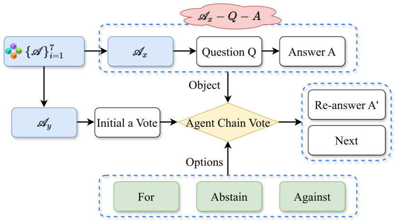
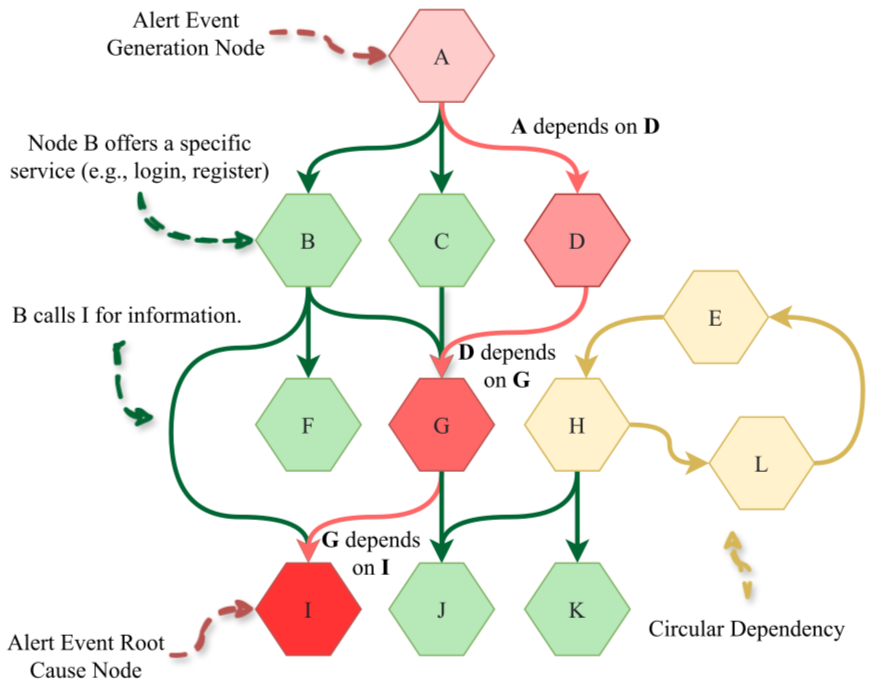
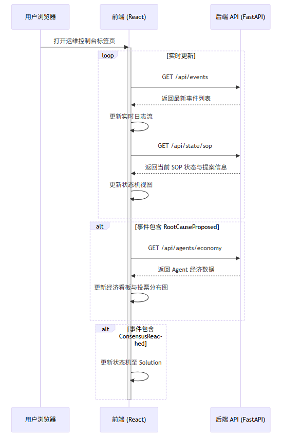
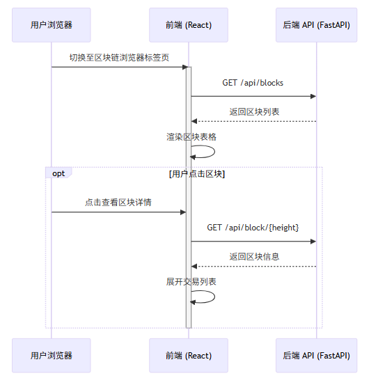
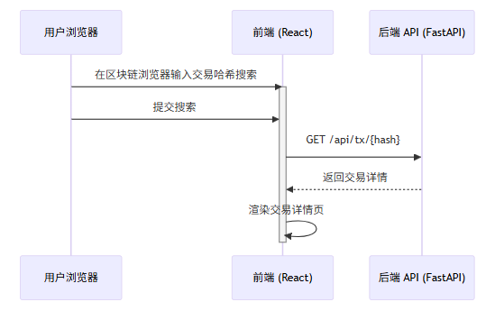

# 软件概述

## 背景与目的

微服务架构（Micro-services Architecture, MSA）已成为云原生系统的主流范式，其高度解耦、独立部署与快速迭代特性极大提升了系统的敏捷性和可扩展性。然而，随着服务数量激增，系统拓扑复杂度呈指数级增长，依赖关系错综复杂，常伴循环依赖，故障传播路径高度非线性。传统根因分析（RCA）方法难以应对数据孤岛与非线性传播，而基于大语言模型（LLM）的单一智能体方案虽具备强大语义理解能力，却存在“幻觉”风险与决策黑箱问题。

本项目参考 EMNLP 2024 Findings 论文《mABC: Multi-Agent Blockchain-inspired Collaboration for Root Cause Analysis in Micro-Services Architecture》，旨在构建一个多智能体协作的微服务根因分析实验系统。通过专业化分工与区块链模拟机制，实现故障根因定位、传播路径还原以及分析过程的可视化审计。

## 参考论文实现内容概述

### 论文基本信息与结构
论文标题：**mABC: Multi-Agent Blockchain-inspired Collaboration for Root Cause Analysis in Micro-Services Architecture**  
作者：Wei Zhang, Hongcheng Guo, Jian Yang 等（共11位，主要来自北京航空航天大学、北京信息科学与技术大学和Cloudwise Research）。  
发表：Findings of the Association for Computational Linguistics: EMNLP 2024（页码4017–4033）。  
论文结构主要包括：
- **1 Introduction**：介绍微服务架构（MSA）中的根因分析（RCA）挑战。
- **2 Methodology**：核心框架设计，包括整体概述、Agent Workflow、多智能体角色、区块链启发式投票机制。
- **3 Experiments**：数据集、评估指标、基线、实现细节、主结果。
- **4 Analysis**：决策效率、人工评估、组件消融。
- **5 Related Work**：微服务RCA和LLM应用的相关研究。
- **6 Conclusion**、**7 Limitations**、**8 Ethical Considerations**。
- **Appendices**：详细案例研究、数据集细节、Prompt模板、Agent角色描述、投票Prompt等。

### 研究目的
随着云原生技术的快速发展，微服务架构(Micro-Services Architecture, MSA)已成为主流，但其系统复杂性指数级增长，导致故障传播(fault propagation)和循环依赖(circular dependencies)问题突出。传统根因分析方法难以应对多样化故障场景，且依赖人工干预效率低下。

论文目的在于提出一个**自动化、智能化的根因分析与修复框架**，针对AIOps（AI for IT Operations）领域，利用大语言模型（LLM）的强大知识表示能力，结合多智能体协作解决复杂故障诊断难题。同时，针对LLM的幻觉（hallucination）问题和MSA中的无限循环风险，提供可靠的治理机制，最终实现从警报触发到根因定位再到解决方案生成的端到端自动化。

主要贡献：
- 首次将多智能体与区块链治理原则融合应用于微服务RCA。
- 提出标准化Agent Workflow避免非终止循环。
- 在公开和新建数据集上验证优越性能，并开源代码与数据集。

### 核心思想与原理
mABC框架的核心创新在于三个相互协同的组件：

1. **多智能体协作（Multi-Agent Collaboration）**  
   框架设计了**7个专业化智能体**，形成去中心化链式结构（Agent Chain），每个智能体基于LLM具备特定领域专长：
   - **Alert Receiver**：接收并优先级排序警报事件。
   - **Process Scheduler**：任务分解与调度。
   - **Data Detective**：采集实时指标、trace和log数据。
   - **Dependency Explorer**：探索服务依赖关系。
   - **Probability Oracle**：评估节点故障概率。
   - **Fault Mapper**：构建故障传播网络（Fault Web）。
   - **Solution Engineer**：生成修复解决方案。

   这些智能体顺序协作，提供多样化视角，避免单智能体知识盲区。

2. **Agent Workflow（标准化工作流）**  
   为防止MSA循环依赖导致的无限推理循环，引入双模式工作流（Figure 3）：
   - **Direct Answer**：简单任务直接零样本或思维链推理。
   - **ReAct Answer**：复杂任务迭代“Thought → Action → Observation”循环，调用外部工具获取实时数据。
   - 严格限制最大步骤（20步），并根据任务难度和上下文动态切换模式，确保过程终止性和效率。

3. **区块链启发式投票机制（Blockchain-Inspired Voting）**  
   为抑制LLM幻觉，引入去中心化决策：
   - 智能体匿名提出答案后，其他智能体投票（For/Against/Abstain）。
   - 投票权重动态计算：**贡献指数（contribution index，活跃度）** + **专长指数（expertise index，历史准确率）**。
   - 双阈值共识：支持率（s ≥ 0.5）和参与率（p ≥ 0.5）同时满足才通过，否则重新推理。
   - 原理借鉴区块链治理的透明、平等和不可篡改，确保决策可靠。

（上图为论文Figure 3：Agent Workflow双模式示意，左侧ReAct循环，右侧Direct Answer。）

（上图示例区块链启发式投票流程，展示智能体间挑战、投票与共识过程。）

### 实验效果
论文在两个数据集上全面评估：
- **AIOps Challenge**：公开数据集，14天1.45亿+日志，覆盖CPU/内存/数据库/网络等警报。
- **Train-Ticket**：新建火车票预订系统（41个微服务），注入多种故障，生成23万+调用链和900+警报。

主要结果（GPT-4-Turbo后端）：
- **根因识别**：Train-Ticket RA 54.4%、PA 48.2%；AIOps RA 45.5%、PA 39.3%；整体平均46.9%，远超ReAct（38.5%）和传统无监督方法（最高31.6%）。
- **决策效率**：15步内完成率（PR）73.0%和68.8%，平均路径长度仅10.4~11.7步。
- **解决方案实用性**：人工评估（1-5分）4.2和3.6分，显著高于ReAct的2.4分。
- **消融实验**：去除任一组件（Workflow、多智能体、投票）均导致性能大幅下降，证明三者缺一不可。

总体而言，mABC框架通过多智能体多样专长、标准化流程和去中心化投票，实现了微服务环境下高效、可靠的自动化根因分析与修复，显著提升AIOps水平，具有重要的学术和工业价值。

**表：mABC 在 Train-Ticket 和 AIOps Challenge 数据集上的主要结果（根因识别性能）**  

| Model                  | Base                | Train-Ticket RA (%) | Train-Ticket PA (%) | Train-Ticket Avg (%) | AIOps RA (%) | AIOps PA (%) | AIOps Avg (%) | Overall Avg (%) |
|------------------------|---------------------|---------------------|---------------------|----------------------|--------------|--------------|---------------|-----------------|
| Decision Tree          | -                   | 36.8                | 34.7                | 35.8                 | 28.3         | 26.7         | 27.5          | 31.6            |
| TraceAnomaly           | -                   | 25.3                | 23.5                | 24.4                 | 20.1         | 18.9         | 19.5          | 22.0            |
| MEPFL                  | -                   | 30.3                | 29.1                | 29.7                 | 33.7         | 29.7         | 31.7          | 30.7            |
| ReAct                  | GPT-3.5-Turbo       | 31.8                | 26.8                | 29.3                 | 25.1         | 22.7         | 23.9          | 26.6            |
| ReAct                  | GPT-4-Turbo         | 43.0                | 38.9                | 41.0                 | 37.5         | 34.4         | 36.0          | 38.5            |
| mABC                   | Llama-3-8B-Instruct | 46.1                | 40.9                | 43.5                 | 43.0         | 39.9         | 41.5          | 42.5            |
| mABC                   | GPT-3.5-Turbo       | 48.1                | 42.8                | 45.5                 | 41.1         | 36.7         | 38.9          | 42.2            |
| mABC                   | GPT-4-Turbo         | **54.4**            | **48.2**            | **51.3**             | **45.5**     | **39.3**     | **42.4**      | **46.9**        |

**说明**：
- **RA**：Root Cause Accuracy（根因准确率）
- **PA**：Path Accuracy（根因路径准确率）
- **Avg**：RA 与 PA 的平均值
- **Overall Avg**：两个数据集平均值的整体均值

## 项目改进的创新点概述

本项目在忠实复现 mABC 论文核心思想的基础上，针对论文中“区块链启发式投票”仅为概念模拟、缺乏强制约束与激励机制的局限，进行了系统性的工程化升级。通过引入多个关键模块，将原框架从松散的多智能体协作系统改造为一个**基于模拟智能合约的 DAO 化自治运维框架**，实现“Code is Law, Token is Trust”的治理理念。

### 引入轻量级区块链底层模块

**模块组成与功能**：实现完整的内存级 Python 区块链系统，包括 `Transaction`、`Block`、`Account` 数据结构，交易池管理、ECDSA 签名验证、Nonce 与 Gas 机制、Merkle Tree 根哈希计算、区块打包与链式维护，以及基于 Pydantic 的严格数据校验。

**实现效果**：所有 Agent 的关键操作（数据采集、根因提案）均封装为交易上链，状态变更与事件记录不可篡改，形成全链路可追溯审计轨迹。

**改进意义**：原论文仅通过内存变量模拟投票权重，本项目真正将分析过程实体化上链，实现了“代码即法律”的强制执行，保证了运维决策的透明性与历史可验证性，为生产级可信运维奠定基础。

### 引入专用 SOP 流程控制合约模块

**模块组成与功能**：设计独立的 `OpsSOPContract`，维护全局运维标准操作程序（SOP）状态机（Init → Data_Collected → Root_Cause_Proposed → Consensus → Solution），提供专用交易接口，并实现严格的前置状态校验与结构化事件发射。同时预留 `advance_to_consensus_phase` 接口供后续治理合约调用。

**实现效果**：Agent 只能在合约允许的状态下执行对应操作，违规交易直接 revert；所有阶段切换自动发射事件, 如 `DataCollected`、`RootCauseProposed`、`ConsensusReached`

**改进意义**：原论文依赖 Prompt 软约束，Agent 易跳步或陷入无限循环。本项目通过链上状态机硬编码，实现“流程即合约”的强制编排，从机制层面大幅抑制 LLM 幻觉导致的流程混乱，确保运维诊断的完整性与合规性。

### 预留经济模型与治理合约模块

**模块组成与功能**：为 OpsToken 系统（发行、转账、余额管理）与治理机制（质押、投票权重计算、自动奖惩）预留清晰接口，并在流程控制合约中设计共识结果回调点，支持后续实现 PoS 质押与 Slashing 罚没。

**实现效果**：当前已支持提案记录与事件触发，待经济合约接入后，可实现提案与投票需质押 Token、共识通过即奖励、失败即罚没的完整闭环。

**改进意义**：原论文投票缺乏风险约束，Agent 易随大流或低质量参与。本项目通过经济激励预留，实现“代币即信任”的博弈机制，使 Agent 在不确定时保持谨慎、在确信时积极争取，促使可信度通过真实经济历史自然涌现，推动系统向自进化自治组织方向演进。

### 引入可视化审计与实时监控模块

**模块组成与功能**：开发基于 React + Ant Design 的运维控制台与区块链浏览器，支持实时日志流滚动、SOP 状态机进度展示、事件查询、Agent 经济排行以及区块/交易审计。

**实现效果**：用户可直观观察多智能体协作全过程、链上事件流转与经济状态变化，支持一键重置与交互演示。

**改进意义**：原论文仅提供命令行日志，本项目通过可视化界面大幅提升系统的可解释性、可观测性与审计友好性，便于教学演示、故障复盘与结果验证。

### 采用高效单机事件驱动架构

**模块组成与功能**：全系统基于内存存储与事件驱动设计，结合 FastAPI 提供高效 REST 接口，支持快速状态重置与重复实验。

**实现效果**：单机环境下即可完整运行多智能体诊断全流程，响应实时、启动快速。

**改进意义**：降低了实验与开发门槛，同时保留向分布式扩展的潜力，使框架更易于教学、研究与后续工程化落地。

综上，这些模块化改进将原 mABC 的概念验证框架升级为一个具备实体区块链约束、强制流程编排、经济激励预留与可视化审计的 DAO 化自治运维实验平台，实现了从“启发式协作”向“合约驱动自治”的范式跃迁，为 AIOps 领域探索高可信、自治理的多智能体系统提供了坚实、可运行的参考实现。

# 功能介绍

## 前端界面基本介绍

项目前端采用 React + Ant Design 框架开发，提供两大核心可视化界面：**运维控制台** 与 **区块链浏览器**。界面设计注重可解释性和审计友好性，支持暗/亮模式切换，整体风格简洁专业。

### 运维控制台

该界面聚焦多智能体协作运维过程的可视化呈现，是用户观察 Agent 协作与系统决策的主要窗口。

- **实时日志流**：左侧面板滚动展示系统运行日志，包括 Agent 的思考过程（Thought）、行动（Action）以及链上事件反馈。

- **SOP 状态机视图**：中央区域展示当前运维标准操作程序（SOP）所处阶段（Init → Data_Collected → Root_Cause_Proposed → Consensus → Solution），当前阶段高亮显示。

- **经济看板**：右侧面板展示各 Agent 的 Token 余额、质押情况与信誉分排行，支持表格查看。规划使用环形图展示当前提案的投票分布与 Agent 权重。

- 运维控制台全景视图

### 区块链浏览器

该界面提供底层区块链数据的浏览与审计功能。

- **区块列表视图**：主页面展示所有区块信息，包括区块高度、哈希值、时间戳、交易数量。支持点击展开区块详情。

- **交易追踪**：支持按交易哈希搜索，或浏览交易列表。交易详情页展示发送方、交易类型、Payload 数据及执行结果。

- **审计视图**：规划支持 Merkle Proof 可视化验证。

- 区块链浏览器区块列表页

- 单区块详情展开视图（含交易列表）

- 交易搜索与详情页

## 后端 API 用例

后端基于 FastAPI 框架开发，提供 RESTful 接口供前端获取链上状态与事件数据。所有接口返回 JSON 格式，支持 CORS 跨域访问。

### 主要 API 详细列表

| 接口路径                  | 方法 | 描述                                      | 请求参数（Query/Path）                  | 请求示例                                      | 返回值示例                                                                 | 用例场景                          |
|---------------------------|------|-------------------------------------------|-----------------------------------------|-----------------------------------------------|------------------------------------------------------------------------------------|-----------------------------------|
| `/api/blocks`             | GET  | 获取完整区块列表（从创世区块开始）        | 无                                      | `GET /api/blocks`                             | `[{"index": 0, "hash": "abc123...", "timestamp": 1735680000, "tx_count": 0}, ...]` | 区块链浏览器渲染所有区块表格      |
| `/api/block/{height}`     | GET  | 根据区块高度获取单个区块完整信息          | `height` (path 参数, int)               | `GET /api/block/5`                            | `{"index": 5, "hash": "def456...", "previous_hash": "...", "transactions": [...], "merkle_root": "..."}` | 查看指定区块详情与包含交易        |
| `/api/tx/{hash}`          | GET  | 根据交易哈希查询交易详情                  | `hash` (path 参数, str)                 | `GET /api/tx/1a2b3c4d5e...`                   | `{"tx_type": "propose_root_cause", "sender": "agent_addr...", "data": {"content": "数据库连接池泄漏"}, "status": "success"}` | 交易搜索与详情展示                |
| `/api/state/sop`          | GET  | 获取当前 SOP 流程状态与活跃提案信息       | 无                                      | `GET /api/state/sop`                          | `{"current_state": "Root_Cause_Proposed", "current_proposal": {"proposal_id": "...", "proposer": "...", "content": "..."}, "incident_data": {...}}` | 运维控制台渲染状态机与当前提案    |
| `/api/events`             | GET  | 获取最近事件日志（支持分页）              | `limit` (query, int, 默认 50)           | `GET /api/events?limit=100`                   | `[{"name": "DataCollected", "timestamp": "2025-12-26T10:00:00", "agent_id": "..."}, {"name": "RootCauseProposed", ...}]` | 实时日志流滚动与审计记录展示      |
| `/api/agents/economy`     | GET  | 获取所有 Agent 的经济相关数据             | 无                                      | `GET /api/agents/economy`                     | `[{"address": "agent1_addr", "balance": 100000, "staked": 5000, "reputation": 1.2}, ...]` | 经济看板渲染排行榜与投票权重计算  |
| `/api/reset`              | POST | 重置系统状态（清空链、状态、账户，用于测试） | 无（或可选 JSON body）                  | `POST /api/reset`                             | `{"success": true, "message": "System reset completed"}`                            | 一键重置演示环境，便于重复测试    |

### 系统交互流程图
前端与后端通过 RESTful API 实现高效交互，支持实时数据更新与用户操作响应。以下按界面标签页分别展示主要交互流程。

#### 图1：运维控制台交互流程

运维控制台通过轮询机制实时获取链上事件与状态，实现动态更新。

#### 图2：区块链浏览器区块浏览流程
区块链浏览器标签页支持区块列表浏览与详情展开。

#### 图3：交易搜索与详情交互流程
支持在区块链浏览器中按交易哈希精确查询并查看详情。

这些交互流程确保前端能够实时、事件驱动地呈现链上动态，同时提供完整的区块与交易审计能力，满足系统透明性与可解释性需求。