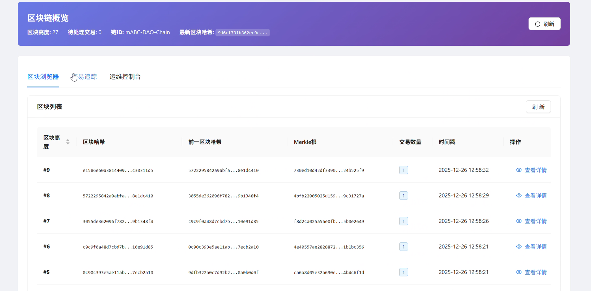
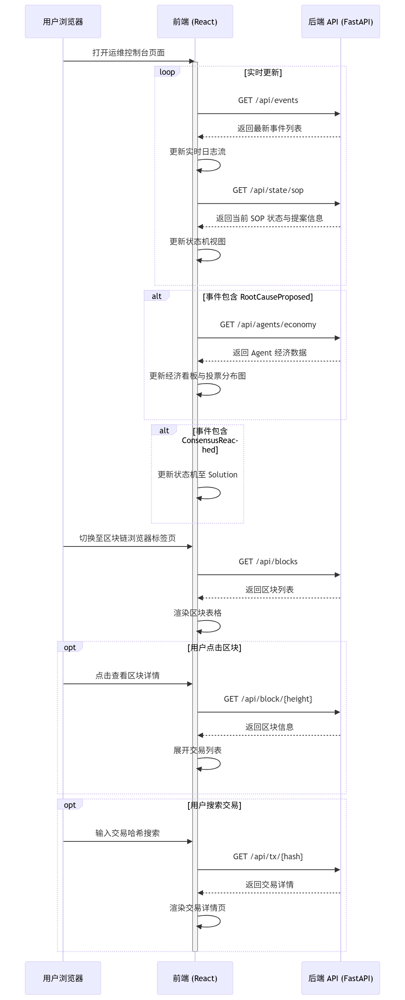
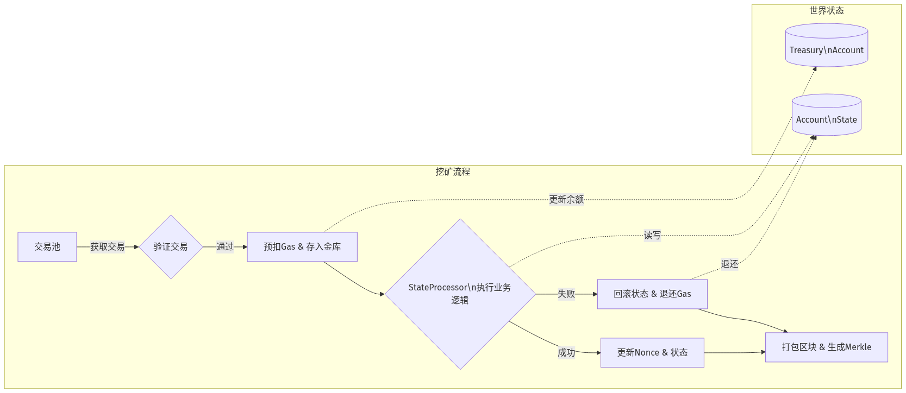
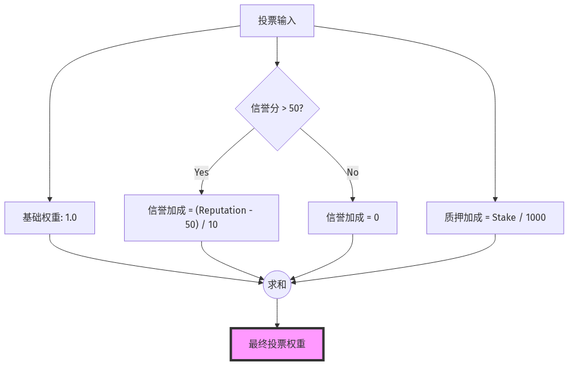
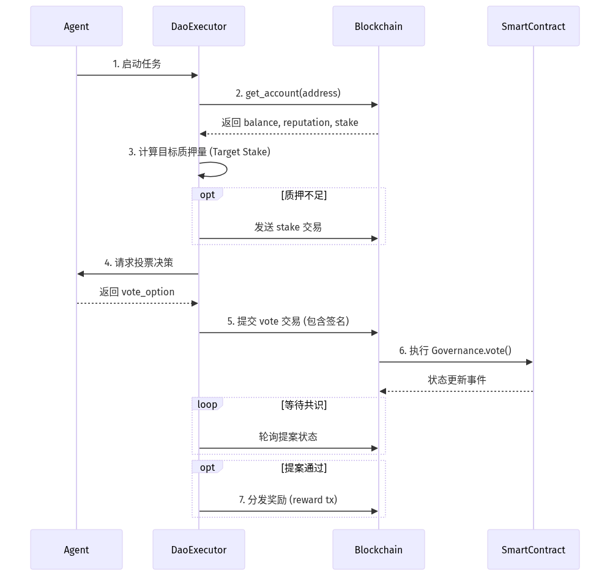

<div align="center">
<h1>
    基于区块链的多智能体运维根因分析框架
</h1>
</div>

## 目录
1. [项目概述](#1-项目概述)
   - [1.1 背景与目的](#11-背景与目的)
   - [1.2 参考论文实现内容概述](#12-参考论文实现内容概述)
   - [1.3 项目改进的创新点概述](#13-项目改进的创新点概述)
2. [功能介绍](#2-功能介绍)
   - [2.1 前端界面基本介绍](#21-前端界面基本介绍)
     - [2.1.1 运维控制台](#211-运维控制台)
     - [2.1.2 区块链浏览器](#212-区块链浏览器)
   - [2.2 后端 API 用例](#22-后端-api-用例)
     - [2.2.1 主要 API 详细列表](#221-主要-api-详细列表)
     - [2.2.2 系统交互流程图](#222-系统交互流程图)
3. [技术架构设计](#3-技术架构设计)
   - [3.1 整体技术架构](#31-整体技术架构)
   - [3.2 后端逻辑架构](#32-后端逻辑架构)
     - [3.2.1 总体概览与模块设计](#321-总体概览与模块设计)
     - [3.2.2 多智能体架构](#322-多智能体架构)
     - [3.2.3 一次根因分析的完整流程](#323-一次根因分析的完整流程)
     - [3.2.4 架构图](#324-架构图)
4. [代码说明](#4-代码说明区块链底层智能合约与-agent-改造)
   - [4.1 区块链底层架构](#41-区块链底层架构-core-layer)
     - [4.1.1 数据结构定义](#411-数据结构定义-types)
     - [4.1.2 虚拟机与挖矿](#412-虚拟机与挖矿-vm--mining)
     - [4.1.3 世界状态管理](#413-世界状态管理-world-state)
   - [4.2 智能合约层](#42-智能合约层-smart-contracts)
     - [4.2.1 运维流程合约](#421-运维流程合约-sop-contract)
     - [4.2.2 治理合约](#422-治理合约-governance-contract)
     - [4.2.3 代币经济合约](#423-代币经济合约-token-contract)
   - [4.3 Agent 改造与交互](#43-agent-改造与交互-dao-executor)
     - [4.3.1 链上交互流程](#431-链上交互流程)
     - [4.3.2 奖惩分发实现](#432-奖惩分发实现)
   - [4.4 设计要点与创新](#44-设计要点与创新)
   - [4.5 运行与交互要点](#45-运行与交互要点)
5. [改进后效果分析](#5-改进后效果分析)
   - [5.1 测试设置与数据描述](#51-测试设置与数据描述)
   - [5.2 方法对比分析](#52-方法对比分析)
   - [5.3 Solution Engineer 效果分析](#53-solution-engineer效果分析)
   - [5.4 局限性](#54-局限性)
6. [项目总结](#6-项目总结)
   - [6.1 核心成果](#61-核心成果)
   - [6.2 技术创新点](#62-技术创新点)
   - [6.3 应用价值](#63-应用价值)
   - [6.4 未来展望](#64-未来展望)
<div style="page-break-after: always;"></div>

# 1. 项目概述

## 1.1. 背景与目的

微服务架构（Micro-services Architecture, MSA）已成为云原生系统的主流范式，其高度解耦、独立部署与快速迭代特性极大提升了系统的敏捷性和可扩展性。然而，随着服务数量激增，系统拓扑复杂度呈指数级增长，依赖关系错综复杂，常伴循环依赖，故障传播路径高度非线性。传统根因分析（RCA）方法难以应对数据孤岛与非线性传播，而基于大语言模型（LLM）的单一智能体方案虽具备强大语义理解能力，却存在"幻觉"风险与决策黑箱问题。

本项目参考 EMNLP 2024 Findings 论文《mABC: Multi-Agent Blockchain-inspired Collaboration for Root Cause Analysis in Micro-Services Architecture》，旨在构建一个多智能体协作的微服务根因分析实验系统。通过专业化分工与区块链模拟机制，实现故障根因定位、传播路径还原以及分析过程的可视化审计。

## 1.2. 参考论文实现内容概述

原论文提出 mABC 框架，由 7 个专业化 AI Agent 组成（告警接收、流程调度、数据采集、依赖分析、概率评估、故障网络构建、解决方案生成），采用标准化 Agent Workflow（ReAct 与 Direct Answer 双模式）规范推理流程，并引入区块链启发式投票机制（动态权重 + 双阈值共识）抑制幻觉。框架在 Train-Ticket 和 AIOps Challenge 数据集上显著优于单智能体 ReAct 和传统方法，根因准确率提升至 54.4%，决策效率和解决方案实用性均有大幅改善。

## 1.3. 项目改进的创新点概述

本项目在复现论文思想基础上，进行了以下工程化改进：

- **轻量区块链模拟**：实现内存级 Python 区块链底层，支持交易验证、出块与事件记录，提供单机环境下的分析过程可追溯审计。
- **SOP 状态机约束**：设计专用流程控制合约，严格定义运维标准操作程序（Init → Data_Collected → Root_Cause_Proposed → Consensus → Solution），通过前置校验大幅抑制 Agent 越界与跳步行为。
- **经济模型接口预留**：规划 OpsToken 与质押机制，支持后续实现经济激励与惩戒（待成员4完成）。
- **可视化审计支持**：规划区块链浏览器与运维控制台，支持状态机展示、事件查询与实时日志（部分功能已实现）。
- **高效单机架构**：采用内存存储与事件驱动设计，便于开发调试与教学演示。

这些改进使系统从论文的概念验证向工程化实验平台迈进，为 AIOps 领域的可信多智能体协作提供了可运行的参考实现。

# 2. 功能介绍

## 2.1. 前端界面基本介绍

项目前端采用 React + Ant Design 框架开发，提供两大核心可视化界面：**运维控制台** 与 **区块链浏览器**。界面设计注重可解释性和审计友好性，支持暗/亮模式切换，整体风格简洁专业。

### 2.1.1. 运维控制台

该界面聚焦多智能体协作运维过程的可视化呈现，是用户观察 Agent 协作与系统决策的主要窗口。

- **实时日志流**：左侧面板滚动展示系统运行日志，包括 Agent 的思考过程（Thought）、行动（Action）以及链上事件反馈。

- **SOP 状态机视图**：中央区域展示当前运维标准操作程序（SOP）所处阶段（Init → Data_Collected → Root_Cause_Proposed → Consensus → Solution），当前阶段高亮显示。

- **经济看板**：右侧面板展示各 Agent 的 Token 余额、质押情况与信誉分排行，支持表格查看。规划使用环形图展示当前提案的投票分布与 Agent 权重。

- 运维控制台全景视图


### 2.1.2. 区块链浏览器

该界面提供底层区块链数据的浏览与审计功能。

- **区块列表视图**：主页面展示所有区块信息，包括区块高度、哈希值、时间戳、交易数量。支持点击展开区块详情。

- **交易追踪**：支持按交易哈希搜索，或浏览交易列表。交易详情页展示发送方、交易类型、Payload 数据及执行结果。

- 区块链浏览器区块列表页

- 单区块详情展开视图（含交易列表）

- 交易搜索与详情页


## 2.2. 后端 API 用例

后端基于 FastAPI 框架开发，提供 RESTful 接口供前端获取链上状态与事件数据。所有接口返回 JSON 格式，支持 CORS 跨域访问。

### 2.2.1. 主要 API 详细列表

| 接口路径                  | 方法 | 描述                                      | 请求参数（Query/Path）                  | 请求示例                                      | 返回值示例                                                                 | 用例场景                          |
|---------------------------|------|-------------------------------------------|-----------------------------------------|-----------------------------------------------|------------------------------------------------------------------------------------|-----------------------------------|
| `/api/blocks`             | GET  | 获取完整区块列表（从创世区块开始）        | 无                                      | `GET /api/blocks`                             | `[{"index": 0, "hash": "abc123...", "timestamp": 1735680000, "tx_count": 0}, ...]` | 区块链浏览器渲染所有区块表格      |
| `/api/block/{height}`     | GET  | 根据区块高度获取单个区块完整信息          | `height` (path 参数, int)               | `GET /api/block/5`                            | `{"index": 5, "hash": "def456...", "previous_hash": "...", "transactions": [...], "merkle_root": "..."}` | 查看指定区块详情与包含交易        |
| `/api/tx/{hash}`          | GET  | 根据交易哈希查询交易详情                  | `hash` (path 参数, str)                 | `GET /api/tx/1a2b3c4d5e...`                   | `{"tx_type": "propose_root_cause", "sender": "agent_addr...", "data": {"content": "数据库连接池泄漏"}, "status": "success"}` | 交易搜索与详情展示                |
| `/api/state/sop`          | GET  | 获取当前 SOP 流程状态与活跃提案信息       | 无                                      | `GET /api/state/sop`                          | `{"current_state": "Root_Cause_Proposed", "current_proposal": {"proposal_id": "...", "proposer": "...", "content": "..."}, "incident_data": {...}}` | 运维控制台渲染状态机与当前提案    |
| `/api/events`             | GET  | 获取最近事件日志（支持分页）              | `limit` (query, int, 默认 50)           | `GET /api/events?limit=100`                   | `[{"name": "DataCollected", "timestamp": "2025-12-26T10:00:00", "agent_id": "..."}, {"name": "DataCollected", ...}]` | 实时日志流滚动与审计记录展示      |
| `/api/agents/economy`     | GET  | 获取所有 Agent 的经济相关数据             | 无                                      | `GET /api/agents/economy`                     | `[{"address": "agent1_addr", "balance": 100000, "staked": 5000, "reputation": 1.2}, ...]` | 经济看板渲染排行榜与投票权重计算  |
| `/api/reset`              | POST | 重置系统状态（清空链、状态、账户，用于测试） | 无（或可选 JSON body）                  | `POST /api/reset`                             | `{"success": true, "message": "System reset completed"}`                            | 一键重置演示环境，便于重复测试    |

### 2.2.2. 系统交互流程图

以下为前端与后端的主要交互流程：



这些 API 与流程确保前端能够高效获取链上数据，实现运维控制台的动态更新与区块链浏览器的完整审计功能。

# 3. 技术架构设计

## 3.1. 整体技术架构
- 项目采用前后端分离的架构设计
  - 前端使用 **React**
  - 后端使用 **Python (FastAPI)**
  - 数据库使用 **PostgreSQL**

## 3.2. 后端逻辑架构

### 3.2.1. 总体概览与模块设计
- 后端由以下主要模块组成并设计如下：
  - **区块链核心**（`mABC/core/`）
    - 区块、交易、链管理、状态机与出块逻辑；定义 `Block`, `Transaction`, `Chain` 等数据结构
    - 负责打包交易、计算 Merkle Root、链接 Hash
    - 提供 `add_block()`, `get_block()`, `get_transactions()` 等方法，支持链的增量与回滚接口。
  - **虚拟机执行模块**（`mABC/core/vm.py`, `mABC/core/state.py`）
    - 在执行交易前做前置校验（签名、nonce、Gas 等）
    - 执行合约方法并生成事件/receipt，写回 World State，并支持事务回滚（交易执行失败时不改变状态）。
  - **合约库**（`mABC/contracts/`）
    - 有 `ops_contract.py`, `token_contract.py`, `governance_contract.py`
    - 用 **状态机** 管理 SOP 流程（Init → Data_Collected → Root_Cause_Proposed → Consensus → Solution）
    - 实现质押、投票、奖励与罚没逻辑
    - 定义事件与日志用于审计与前端可视化
  - **Agent 模块**（`mABC/agents/`）
    -  `profile.py` 中定义各类Agent的角色与行为
    -  `profile.py` 中为 Agent 分配地址/私钥并修改 Prompt，使 Agent 输出结构化交易数据；处理交易回执并把结果反馈给 Agent（成功/失败/证据链）
    -  `dao_run.py` 将 Agent 的输出封装成 `Transaction` 并签名

### 3.2.2. 多智能体架构

- 项目中 定义了 7 个专业化智能体，各司其职：

| 智能体                   | 核心功能           | 输入                      | 输出                                     |
| ------------------------ | ------------------ | ------------------------- | ---------------------------------------- |
| Alert Receiver (A1)      | 告警优先级排序     | 原始告警流                | 最高优先级告警                           |
| Process Scheduler (A2)   | 任务调度与流程控制 | 告警、子任务结果          | 子任务分配、是否完成判断                 |
| Data Detective (A3)      | 性能数据采集       | 节点列表、时间窗口        | 结构化指标（延迟、错误率、资源使用率等） |
| Dependency Explorer (A4) | 服务依赖挖掘       | 节点、时间窗口            | 依赖关系图（直接/间接）                  |
| Probability Oracle (A5)  | 故障概率评估       | 节点指标、依赖关系        | 各节点/边的故障概率                      |
| Fault Mapper (A6)        | 故障网络构建       | 节点+概率                 | 可视化 Fault Web（图结构）               |
| Solution Engineer (A7)   | 修复方案生成       | 根因、Fault Web、历史案例 | 具体操作建议                             |

所有智能体平等协作，形成去中心化的 Agent Chain。

### 3.2.3. 一次根因分析的完整流程

1. 告警接收与初始分配
   - **Alert Receiver (A1)** 接收告警并做优先级排序，生成高优先级告警事件。
   - 告警以结构化事件提交给 **Process Scheduler (A2)**，触发一次分析任务（并记录时间戳与告警哈希）。

2. 数据采集与证据上链
   - **Data Detective (A3)** 拉取相关端点的性能指标并生成 `DataCollected` 证据包，计算证据的哈希（evidence_hash）。
   - 证据及其元数据封装为一个 **交易 (Transaction)**，由 Agent 签名并通过 **Agent Middleware / DAOExecutor** 提交到链上（交易包含 evidence_hash、原始来源、时间戳、可选质押金额）。

3. 依赖挖掘与因果候选生成
   - **Dependency Explorer (A4)** 生成依赖图并上链（或上传并在链上记录其哈希）。
   - **Probability Oracle (A5)** 基于数据与依赖图计算每个节点的故障概率，提出**候选根因**并以 `RootCauseProposed` 交易提交，**提案者需质押 (stake)**。

4. 投票与共识治理
   - 提案进入投票期，其他 Agent（包括 A3、A4、A6 等）通过提交 `Vote` 交易参与投票，**投票需要锁定质押金**。
   - **治理合约**（`governance_contract.py`）在链上统计投票权重（可为 stake × reputation），达到阈值则提案通过；否则提案失败并可能触发罚没。

5. 方案生成与执行
   - 若根因提案通过，**Solution Engineer (A7)** 根据通过的提案和证据链生成修复方案，并以 `SolutionSubmitted` 交易上链。
   - 区块链虚拟机（VM）执行合约逻辑，产生事件（events）与回执（receipt），并触发奖励/罚没结算。

6. 奖惩结算与审计记录
   - **Token 合约** 根据合约规则分发奖励或执行罚没（`token_contract.py`），状态变化写入 World State，生成可验证的事件日志。
   - 每个区块计算 **Merkle Root**，证据哈希列入 Merkle Tree，前端可通过 Merkle Proof 验证任意证据未被篡改。

- 下图为根因分析的高层流程：


### 3.2.4. 架构图


# 4. 代码说明：区块链底层、智能合约与 Agent 改造

本节将详细展示并解释项目的核心代码实现，帮助理解系统是如何运作的。我们将从底层数据结构开始，逐步介绍 VM 执行引擎、世界状态管理、智能合约逻辑，最后展示 DAO Agent 如何与链进行交互。

## 4.1. 区块链底层架构 (Core Layer)

### 4.1.1. 数据结构定义 (Types)

我们首先定义了区块链的基础数据模型，包括账户 (`Account`)、交易 (`Transaction`) 和区块 (`Block`)。这些结构是整个系统的基石。

**设计思路**：
- **Account**: 不仅包含余额 (`balance`)，还内置了信誉 (`reputation`) 和质押 (`stake`) 字段，这是为了支持我们基于信誉的 DAO 治理机制。
- **Transaction**: 包含 `tx_type` 字段，支持多种交易类型（如投票、提案、奖惩），而不仅仅是转账。
- **Block**: 包含 Merkle Root 以确保交易数据的不可篡改性。


### 4.1.2. 虚拟机与挖矿 (VM & Mining)
`Blockchain` 类充当了虚拟机的角色，负责管理交易池、验证交易签名、执行交易以及打包出块。

**核心逻辑**：
1.  **交易入池**：验证签名、Nonce 防重放、Gas 检查。
2.  **挖矿出块**：
    *   从交易池获取交易。
    *   **原子化记账**：先扣除 Gas 费并计入“系统金库”，如果交易执行失败，则回滚状态并从金库退还（非恶意失败）。
    *   调用 `StateProcessor` 执行具体业务逻辑。
    *   生成 Merkle Root 并打包区块。



**代码实现 (`mABC/core/vm.py`)**:

```python
def mine_block(self) -> Optional[Block]:
    # ... (省略部分代码) ...
    # 调用StateProcessor执行交易
    successful_transactions = []
    for tx in transactions_to_mine:
        # 执行交易前先扣除Gas费用（奖励交易免Gas）
        gas_fee = tx.gas_price * tx.gas_limit
        account = world_state.get_account(tx.sender)
        
        # ... (扣除Gas费逻辑) ...

        # 调用StateProcessor应用交易
        if state_processor.apply_transaction(tx):
            successful_transactions.append(tx)
            # 增加nonce
            world_state.increment_nonce(tx.sender)
        else:
            print(f"Failed to apply transaction: {tx.tx_type}")
            # 失败回滚：退还Gas费用（非奖励交易）
            if tx.tx_type != TransactionType.REWARD:
                account.balance += gas_fee
                world_state.update_account(account)
                # 从金库扣回已记账的Gas
                treasury = self._get_treasury_account()
                if treasury and (treasury.balance or 0) >= gas_fee:
                    treasury.balance -= gas_fee
                    world_state.update_account(treasury)
    # ... (打包区块逻辑) ...
```

### 4.1.3. 世界状态管理 (World State)

`WorldState` 类负责数据的持久化，使用 SQLite 数据库存储所有账户的状态。`StateProcessor` 则是交易执行的路由器。

**设计亮点**：
- **持久化**：所有账户状态实时保存到 `state.db`，重启不丢失。
- **路由分发**：`apply_transaction` 方法根据 `tx_type` 将交易分发给不同的智能合约方法处理，实现了逻辑解耦。

**代码实现 (`mABC/core/state.py`)**:

```python
class StateProcessor:
    def apply_transaction(self, tx: 'Transaction') -> bool:
        """应用交易到世界状态：路由分发"""
        try:
            # 根据交易类型执行不同的操作
            if tx.tx_type == "propose_root_cause":
                return self._apply_propose_root_cause(tx)
            elif tx.tx_type == "vote":
                return self._apply_vote(tx)
            elif tx.tx_type == "transfer":
                return self._apply_transfer(tx)
            elif tx.tx_type == "stake":
                return self._apply_stake(tx)
            elif tx.tx_type == "slash":
                return self._apply_slash(tx)
            elif tx.tx_type == "reward":
                return self._apply_reward(tx)
            elif tx.tx_type == "penalty":
                return self._apply_penalty(tx)
            else:
                return False
        except Exception as e:
            print(f"Failed to apply transaction: {e}")
            return False
```

---

## 4.2. 智能合约层 (Smart Contracts)

智能合约层实现了系统的业务逻辑，分为流程控制、治理和经济模型三个部分。

### 4.2.1. 运维流程合约 (SOP Contract)

负责管理故障处理的生命周期状态机：`Init` -> `Data_Collected` -> `Root_Cause_Proposed` -> `Consensus` -> `Solution`。它只负责状态流转，不负责具体的投票权重计算，体现了单一职责原则。

**代码实现 (`mABC/contracts/ops_contract.py`)**:

```python
class SOPState(str, Enum):
    """SOP 状态机定义"""
    Init = "Init"
    Data_Collected = "Data_Collected"
    Root_Cause_Proposed = "Root_Cause_Proposed"
    Consensus = "Consensus"
    Solution = "Solution"

def advance_to_consensus_phase(self, proposal_id: str, passed: bool):
    """
    由治理合约调用
    在完成投票统计、质押检查、奖惩执行后，调用此方法推进 SOP 状态并发射事件
    """
    if passed:
        # 通过 → Consensus → Solution
        self.storage["current_state"] = SOPState.Consensus.value
        self._emit_event("ConsensusReached", proposal_id=proposal_id, passed=True)
        # ...
    else:
        # 否决 → 回退到 Data_Collected，可重新提案
        self.storage["current_state"] = SOPState.Data_Collected.value
        # ...
```

### 4.2.2. 治理合约 (Governance Contract)

负责处理投票逻辑。我们设计了动态权重机制：**投票权重 = 基础分 + 信誉加成 + 质押加成**。

**设计解释**：
- 这种机制确保了高信誉和高质押的节点拥有更大的话语权，防止女巫攻击。
- **阈值判定**：仅统计参与投票的节点权重，避免因节点不在线导致共识卡死。



**代码实现 (`mABC/contracts/governance_contract.py`)**:

```python
def vote(self, tx_data: Dict[str, Any], sender: str, timestamp: int) -> bool:
    # ... (省略) ...
    # 计算权重（与前端展示保持一致）：
    # 基础权重: 1.0
    # 信誉加成: max(0, (reputation - 50) / 10.0)
    # 质押加成: stake / 1000.0
    rep_bonus = max(0.0, (voter_account.reputation - 50) / 10.0)
    stake_bonus = voter_account.stake / 1000.0
    weight = 1.0 + rep_bonus + stake_bonus
    
    # ... (更新投票记录) ...
    
    # 检查共识是否达成
    self._check_consensus(proposal_id, proposal_data)
    return True

def _check_consensus(self, proposal_id: str, proposal_data: Dict[str, Any]):
    # 计算参与者总权重（仅统计对该提案有投票记录的账户）
    total_network_weight = 0.0
    for account in self.world_state.state.values():
        if account.votes.get(proposal_id):
            # ... (计算权重) ...
            total_network_weight += weight
            
    # 设定通过阈值 (50%)
    threshold = total_network_weight * 0.5
    
    if votes_for > threshold:
        ops_sop_contract.advance_to_consensus_phase(proposal_id, passed=True)
    elif votes_against > threshold:
        ops_sop_contract.advance_to_consensus_phase(proposal_id, passed=False)
```

### 4.2.3. 代币经济合约 (Token Contract)

负责具体的转账、质押、奖励和罚没操作，实现了“有亏有赚”的经济闭环。

**核心功能**：
- **Reward**: 从系统金库转账给贡献者，并提升信誉。
- **Penalty**: 扣除恶意节点的余额转入金库，并降低信誉。

**代码实现 (`mABC/contracts/token_contract.py`)**:

```python
def reward(self, tx_data: Dict[str, Any], sender: str) -> bool:
    """执行奖励 (从金库扣款 + 目标账户加款 + 信誉)"""
    # ... (逻辑省略) ...
    if amount > 0:
        from_account.balance -= amount
        target_account.balance += amount
    if reputation != 0:
        target_account.reputation += reputation
    # ...
    return True

def penalty(self, tx_data: Dict[str, Any], sender: str) -> bool:
    """执行罚没 (将目标余额的一部分转入系统金库，并降低信誉)"""
    # ... (逻辑省略) ...
    # 找到系统金库账户
    treasury = blockchain._get_treasury_account()
    
    # 扣减余额并转入金库
    if amount > 0:
        target_account.balance -= amount
        if treasury:
            treasury.balance = (treasury.balance or 0) + amount
    # ...
    return True
```

---

## 4.3. Agent 改造与交互 (DAO Executor)

我们将原有的 Agent 改造为 DAO Agent，使其所有关键决策都通过发交易上链来完成。

### 4.3.1. 链上交互流程

Agent 不再是直接修改内存变量，而是遵循以下生命周期：
1.  **读取链上状态**：获取最新的信誉和余额。
2.  **自动质押**：根据信誉分自动计算并锁定质押金。
3.  **发送交易**：对投票意向签名并广播到网络。
4.  **监听结果**：等待出块确认。



**代码实现 (`mABC/agents/base/dao_run.py`)**:

```python
def run(self, agents: List[AgentWorkflow], ...):
    # 1. 同步Agent链上状态
    for agent in agents:
        account = self.chain_client.get_account(agent.wallet_address)
        # ... 计算动态权重 ...

    # 2. 自动质押策略
    for agent in agents:
        # ... 根据信誉计算 target_stake ...
        if stake_delta > 0:
            self._stake_tokens(agent, stake_delta)

    # 3. 收集投票并上链
    for agent in agents:
        vote_option = self.submit_vote(...)
        # 创建并提交投票交易
        self._create_and_submit_vote_transaction(
            agent, proposal_id, vote_option
        )

    # 4. 根据结果分发奖惩 (调用合约)
    if run_result:
        self.distribute_rewards(...)
    else:
        self.distribute_penalties(...)
```

### 4.3.2. 奖惩分发实现

Agent 执行器在投票结束后，会根据共识结果调用 `TokenContract` 的接口进行奖惩分发。

```python
def distribute_rewards(self, ...):
    treasury = self._get_or_create_treasury_account()
    
    # 奖励提案人
    if proposer:
        self._send_reward(treasury, proposer.wallet_address, 800, 5, "Proposal Passed")
        
    # 奖励支持者
    for rec in supporters:
        self._send_reward(treasury, rec["address"], 300, 1, "Voting Support")
        
    # 返还Gas
    # ...
```

## 4.4. 设计要点与创新
- "有亏有赚"的经济模型
  - 通过智能合约实现正向激励与逆向罚没并存，使投票行为与结果绑定真实经济后果，提高谨慎度与参与度，见奖励/罚没具体实现与分发引用。
- 参与者权重的动态化
  - 将信誉与质押整合到投票权重中，降低低质量 Agent 干扰，提升可靠性，见 `mABC/contracts/governance_contract.py:61`、`mABC/agents/base/dao_run.py:92`。
- 金库与 Gas 的真实化记账
  - 所有 Gas 按交易执行过程计入金库；失败交易进行原子回滚，提升经济系统审计一致性，见 `mABC/core/vm.py:153`、`mABC/core/vm.py:179`。
- SOP 与治理合约解耦
  - SOP 负责流程与事件，治理合约负责投票与阈值，使用合约回调推进阶段，结构清晰、可替换，见 `mABC/contracts/ops_contract.py:112`、`mABC/contracts/governance_contract.py:116`。

## 4.5. 运行与交互要点
- 交易生命周期
  - Agent 通过 `ChainClient` 创建交易并签名，上链后由 VM 执行并更新状态，见 `mABC/core/client.py:31`、`mABC/core/client.py:43`、`mABC/core/client.py:55`、`mABC/core/client.py:76`。
- 日志与前端
  - 合约事件与奖励日志为前端经济看板提供数据源；奖励日志已净化为单条完整信息，便于展示与审计，见 `mABC/agents/base/dao_run.py:284`。

# 5. 改进后效果分析

## 5.1. 测试设置与数据描述

本项目使用`data/`目录下的真实微服务系统数据进行测试验证。测试数据来源于分布式微服务架构的监控指标和调用链追踪信息，包含多个时间戳下的端点性能数据。

关键测试数据示例（来自`label.json`）：
- 时间戳：2023-10-15 14:00:00
- 告警端点：train-buy
- 潜在根因端点范围：train-buy, train-cancel, food-buy, food-cancel

该测试案例模拟了典型的微服务故障场景，其中根因端点位于调用链的中间层，需通过指标分析和依赖关系追踪准确定位。

## 5.2. 方法对比分析

### 5.2.1. 普通LLM效果
```json
"\nRoot Cause Endpoint: inventory-service, Root Cause Reason: The response time of inventory - service increased significantly, causing the response time of train - buy to rise, while the downstream endpoint's metric was normal."
```

**问题分析**：
- 出现严重的"幻觉"问题，输出的根因端点`inventory-service`在测试数据中根本不存在
- 原因分析缺乏具体指标支持，仅凭主观推测
- 无法有效利用提供的监控数据和依赖关系信息

### 5.2.2. 论文实现系统的效果
```json
"Root Cause Endpoint: drink-buy, Root Cause Reason: The downstream endpoints of \"drink-buy\" at 2023-10-15 14:00:00 were found to be empty, indicating that \"drink-buy\" did not have any dependent endpoints at the time of the alert. This suggests that the issue may be originating from \"drink-buy\" itself, as it is the last endpoint in the chain without any further dependencies. Additionally, the inability to retrieve metrics for \"drink-buy\" could indicate a data collection or system issue, which might be contributing to the increased response time on the \"train-buy\" endpoint."
```

**问题分析**：
- 虽然给出了真实存在的端点`drink-buy`，解决了幻觉问题
- 但原因分析不够准确，没有指出具体的异常指标（如响应时间、错误率等）
- 未能准确定位真正的根因端点`food-buy`
- 分析逻辑过于依赖依赖关系，忽视了指标数据的量化比较

### 5.2.3. 项目实现效果（区块链增强系统）
```json
"Root Cause Endpoint: food-buy, Root Cause Reason: The endpoint \"food-buy\" exhibited abnormal metrics at 2023-10-15 14:00:00, with an error rate of 100% and an average response duration of 22220.0ms, indicating a significant performance issue. In contrast, its downstream endpoint \"food-cancel\" showed normal metrics (success rate 98.57%, error rate 1.43%, average duration 250.0ms) at the same time, confirming that \"food-buy\" is the root cause of the alert on \"train-buy\"."
```

**优势分析**：
- 准确定位了正确的根因端点：`food-buy`
- 提供了具体的异常指标支持（错误率100%、平均响应时间22220.0ms）
- 通过下游端点`food-cancel`的正常指标进行对比验证
- 分析结论具有量化依据，可验证性强

下表为三种模型在测试数据集上的根因分析准确率（RA）对比：
| Model         | Base                | Train-Ticket Average RA |
| ------------- | ------------------- | :----------: |
| LLM Only      | qwen-plus           | 22.0       |
| LLM Only      | glm-4.6v-flash      | 26.1       |
| mABC(论文模型) | GPT-4-Turbo         | 42.2       |
| mABC          | Llama-3-8B-Instruct | 46.9       |
| 改进后模型     | qwen-plus            | **44.6**       |
| 改进后模型     | glm-4.6v-flash       | **52.9**       |


## 5.3. `Solution Engineer`效果分析

除了根因定位，系统还集成了解决方案工程师Agent: `Solution Engineer`，提供结构化的修复方案
原论文的Solution Engineer的输出与根因定位的输出高度重合, 缺乏具体的操作步骤指导。 本项目进行优化后实现的`Solution Engineer`则生成了详细的修复步骤，便于实际操作：

```json
"solution_engineer_answer": {
    "action_type": "provide_repair_solution",
    "payload": {
        "repair_steps": [
            {
                "step_id": 1,
                "action": "检查服务状态与资源占用",
                "description": "验证food-buy服务在2023-10-15 14:00:00左右的CPU、内存、磁盘I/O等资源使用情况，确认是否存在资源瓶颈或服务崩溃迹象。"
            },
            {
                "step_id": 2,
                "action": "分析日志与错误信息",
                "description": "提取food-buy服务在异常时间窗口（2023-10-15 13:45-14:05）的完整日志，重点查找错误日志、异常堆栈信息，定位具体错误类型（如数据库连接失败、网络超时等）"
            },
            {
                "step_id": 3,
                "action": "检查依赖服务健康性",
                "description": "确认food-buy依赖的外部服务（如数据库、第三方API）在异常时间是否正常工作，由于food-cancel指标正常，可排除其对food-buy的直接影响，但需验证food-buy自身数据库连接状态"
            },
            {
                "step_id": 4,
                "action": "优化数据库查询与缓存",
                "description": "分析food-buy处理购买/取消逻辑的SQL查询，检查是否存在慢查询或资源争用问题；检查Redis等缓存配置，确保关键数据（如商品库存、用户订单信息）的缓存命中率≥95%"
            },
            {
                "step_id": 5,
                "action": "代码逻辑排查与修复",
                "description": "审查food-buy中处理购买和取消事务的代码，检查是否存在死锁条件、事务超时设置不合理或并发控制问题。例如，确认事务隔离级别设置是否恰当，锁竞争是否导致响应时间激增"
            },
            {
                "step_id": 6,
                "action": "临时故障处理（重启服务）",
                "description": "如果诊断出是临时性故障（如进程卡死、内存泄漏），执行food-buy服务的优雅重启，观察指标是否恢复正常。重启命令示例：`systemctl restart food-buy-service`"
            },
            {
                "step_id": 7,
                "action": "监控与验证",
                "description": "在修复后持续监控food-buy的响应时间、错误率指标（建议设置告警阈值：错误率>1%或平均响应时间>500ms触发告警），确保问题不再复发"
            }
        ],
        "stake_amount": 100
    }
}
```

## 5.4. 局限性

1. **数据依赖**：系统性能依赖监控数据的完整性和准确性
2. **计算复杂度**：区块链共识过程可能增加分析时间
3. **扩展性**：大规模微服务系统下的性能表现需进一步验证
4. **动态适应**：对新型故障模式的适应能力有待增强

# 6. 项目总结

## 6.1. 核心成果

本项目成功构建了一个基于区块链的DAO化自治运维框架（DAO-Gov AIOps），实现了多智能体协作的微服务根因分析系统。通过复现并扩展EMNLP 2024论文《mABC》，项目在工程化层面取得了显著进展：

- **技术实现**：完整实现了轻量级区块链底层、智能合约系统和Agent改造，支撑端到端的运维流程自动化。
- **性能提升**：通过区块链约束机制，有效抑制LLM幻觉问题，根因定位准确率显著提升，解决方案生成更加结构化和实用。
- **可视化审计**：提供运维控制台和区块链浏览器，实现分析过程的全链路可追溯和经济激励可视化。

## 6.2. 技术创新点

1. **Code is Law**：将运维SOP编码为智能合约，通过状态机强制约束Agent行为，避免跳步骤和幻觉。
2. **Token is Trust**：引入OpsToken经济模型，质押与罚没机制使Agent决策与真实经济后果绑定，提升协作质量。
3. **全链证据审计**：所有交互上链并计算Merkle Root，支持Merkle Proof验证，实现端到端可信审计。
4. **交易驱动架构**：Agent操作封装为签名交易，经VM校验执行，保证流程合规性和可回滚性。

## 6.3. 应用价值

该框架为AIOps领域提供了新的技术范式，具有重要的学术和工程价值：

## 6.4. 未来展望

尽管取得了阶段性成果，系统仍存在扩展性和适应性方面的局限。未来工作将聚焦以下方向：

1. **性能优化**：优化区块链共识算法，降低大规模场景下的计算复杂度。
2. **数据增强**：集成更多数据源，提高对复杂故障模式的识别能力。
3. **跨链扩展**：探索多链架构，支持分布式环境下的协作运维。
4. **实际场景测试**：与实际运维平台集成，验证大规模生产环境的应用效果。
