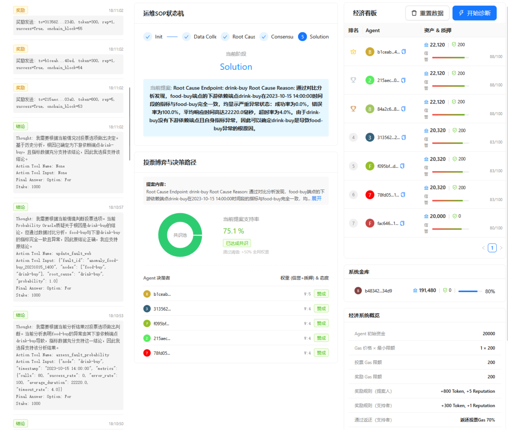
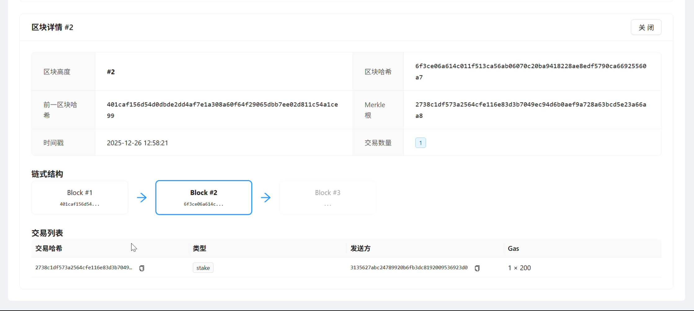
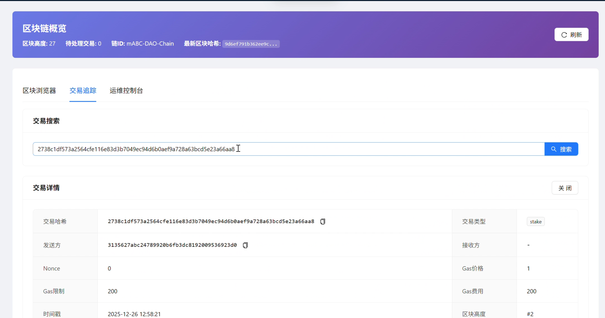
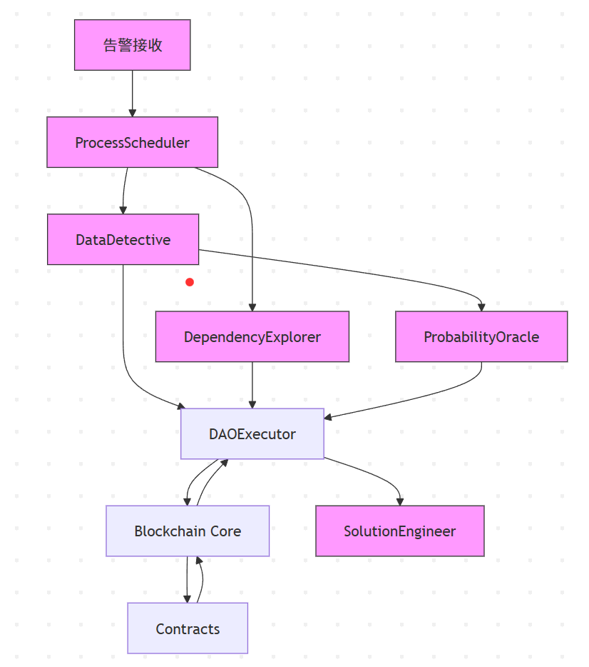

<div align="center">
<h1>
    基于区块链的多智能体运维根因分析框架
</h1>
</div>

[TOC]
<div style="page-break-after: always;"></div>

# 1. 项目概述

## 1.1. 背景与目的

微服务架构（Micro-services Architecture, MSA）已成为云原生系统的主流范式，其高度解耦、独立部署与快速迭代特性极大提升了系统的敏捷性和可扩展性。然而，随着服务数量激增，系统拓扑复杂度呈指数级增长，依赖关系错综复杂，常伴循环依赖，故障传播路径高度非线性。传统根因分析（RCA）方法难以应对数据孤岛与非线性传播，而基于大语言模型（LLM）的单一智能体方案虽具备强大语义理解能力，却存在"幻觉"风险与决策黑箱问题。

本项目参考 EMNLP 2024 Findings 论文《mABC: Multi-Agent Blockchain-inspired Collaboration for Root Cause Analysis in Micro-Services Architecture》，旨在构建一个多智能体协作的微服务根因分析实验系统。通过专业化分工与区块链模拟机制，实现故障根因定位、传播路径还原以及分析过程的可视化审计。

## 1.2. 参考论文实现内容概述

原论文提出 mABC 框架，由 7 个专业化 AI Agent 组成（告警接收、流程调度、数据采集、依赖分析、概率评估、故障网络构建、解决方案生成），采用标准化 Agent Workflow（ReAct 与 Direct Answer 双模式）规范推理流程，并引入区块链启发式投票机制（动态权重 + 双阈值共识）抑制幻觉。框架在 Train-Ticket 和 AIOps Challenge 数据集上显著优于单智能体 ReAct 和传统方法，根因准确率提升至 54.4%，决策效率和解决方案实用性均有大幅改善。

## 1.3. 项目改进的创新点概述

本项目在复现论文思想基础上，进行了以下工程化改进：

- **轻量区块链模拟**：实现内存级 Python 区块链底层，支持交易验证、出块与事件记录，提供单机环境下的分析过程可追溯审计。
- **SOP 状态机约束**：设计专用流程控制合约，严格定义运维标准操作程序（Init → Data_Collected → Root_Cause_Proposed → Consensus → Solution），通过前置校验大幅抑制 Agent 越界与跳步行为。
- **经济模型接口预留**：规划 OpsToken 与质押机制，支持后续实现经济激励与惩戒（待成员4完成）。
- **可视化审计支持**：规划区块链浏览器与运维控制台，支持状态机展示、事件查询与实时日志（部分功能已实现）。
- **高效单机架构**：采用内存存储与事件驱动设计，便于开发调试与教学演示。

这些改进使系统从论文的概念验证向工程化实验平台迈进，为 AIOps 领域的可信多智能体协作提供了可运行的参考实现。

# 2. 功能介绍

## 2.1. 前端界面基本介绍

项目前端采用 React + Ant Design 框架开发，提供两大核心可视化界面：**运维控制台** 与 **区块链浏览器**。界面设计注重可解释性和审计友好性，支持暗/亮模式切换，整体风格简洁专业。

### 2.1.1. 运维控制台

该界面聚焦多智能体协作运维过程的可视化呈现，是用户观察 Agent 协作与系统决策的主要窗口。

- **实时日志流**：左侧面板滚动展示系统运行日志，包括 Agent 的思考过程（Thought）、行动（Action）以及链上事件反馈。

- **SOP 状态机视图**：中央区域展示当前运维标准操作程序（SOP）所处阶段（Init → Data_Collected → Root_Cause_Proposed → Consensus → Solution），当前阶段高亮显示。

- **经济看板**：右侧面板展示各 Agent 的 Token 余额、质押情况与信誉分排行，支持表格查看。规划使用环形图展示当前提案的投票分布与 Agent 权重。

- 运维控制台全景视图



### 2.1.2. 区块链浏览器

该界面提供底层区块链数据的浏览与审计功能。

- **区块列表视图**：主页面展示所有区块信息，包括区块高度、哈希值、时间戳、交易数量。支持点击展开区块详情。

- **交易追踪**：支持按交易哈希搜索，或浏览交易列表。交易详情页展示发送方、交易类型、Payload 数据及执行结果。

- 区块链浏览器区块列表页

- 单区块详情展开视图（含交易列表）

- 交易搜索与详情页


## 2.2. 后端 API 用例

后端基于 FastAPI 框架开发，提供 RESTful 接口供前端获取链上状态与事件数据。所有接口返回 JSON 格式，支持 CORS 跨域访问。

### 2.2.1. 主要 API 详细列表

| 接口路径                  | 方法 | 描述                                      | 请求参数（Query/Path）                  | 请求示例                                      | 返回值示例                                                                 | 用例场景                          |
|---------------------------|------|-------------------------------------------|-----------------------------------------|-----------------------------------------------|------------------------------------------------------------------------------------|-----------------------------------|
| `/api/blocks`             | GET  | 获取完整区块列表（从创世区块开始）        | 无                                      | `GET /api/blocks`                             | `[{"index": 0, "hash": "abc123...", "timestamp": 1735680000, "tx_count": 0}, ...]` | 区块链浏览器渲染所有区块表格      |
| `/api/block/{height}`     | GET  | 根据区块高度获取单个区块完整信息          | `height` (path 参数, int)               | `GET /api/block/5`                            | `{"index": 5, "hash": "def456...", "previous_hash": "...", "transactions": [...], "merkle_root": "..."}` | 查看指定区块详情与包含交易        |
| `/api/tx/{hash}`          | GET  | 根据交易哈希查询交易详情                  | `hash` (path 参数, str)                 | `GET /api/tx/1a2b3c4d5e...`                   | `{"tx_type": "propose_root_cause", "sender": "agent_addr...", "data": {"content": "数据库连接池泄漏"}, "status": "success"}` | 交易搜索与详情展示                |
| `/api/state/sop`          | GET  | 获取当前 SOP 流程状态与活跃提案信息       | 无                                      | `GET /api/state/sop`                          | `{"current_state": "Root_Cause_Proposed", "current_proposal": {"proposal_id": "...", "proposer": "...", "content": "..."}, "incident_data": {...}}` | 运维控制台渲染状态机与当前提案    |
| `/api/events`             | GET  | 获取最近事件日志（支持分页）              | `limit` (query, int, 默认 50)           | `GET /api/events?limit=100`                   | `[{"name": "DataCollected", "timestamp": "2025-12-26T10:00:00", "agent_id": "..."}, {"name": "DataCollected", ...}]` | 实时日志流滚动与审计记录展示      |
| `/api/agents/economy`     | GET  | 获取所有 Agent 的经济相关数据             | 无                                      | `GET /api/agents/economy`                     | `[{"address": "agent1_addr", "balance": 100000, "staked": 5000, "reputation": 1.2}, ...]` | 经济看板渲染排行榜与投票权重计算  |
| `/api/reset`              | POST | 重置系统状态（清空链、状态、账户，用于测试） | 无（或可选 JSON body）                  | `POST /api/reset`                             | `{"success": true, "message": "System reset completed"}`                            | 一键重置演示环境，便于重复测试    |

### 2.2.2. 系统交互流程图

以下为前端与后端的主要交互流程：


这些 API 与流程确保前端能够高效获取链上数据，实现运维控制台的动态更新与区块链浏览器的完整审计功能。

# 3. 技术架构设计

## 3.1. 整体技术架构
- 项目采用前后端分离的架构设计
  - 前端使用 **React**
  - 后端使用 **Python (FastAPI)**
  - 数据库使用 **PostgreSQL**

## 3.2. 后端逻辑架构

### 3.2.1. 总体概览与模块设计
- 后端由以下主要模块组成并设计如下：
  - **区块链核心**（`mABC/core/`）
    - 区块、交易、链管理、状态机与出块逻辑；定义 `Block`, `Transaction`, `Chain` 等数据结构
    - 负责打包交易、计算 Merkle Root、链接 Hash
    - 提供 `add_block()`, `get_block()`, `get_transactions()` 等方法，支持链的增量与回滚接口。
  - **虚拟机执行模块**（`mABC/core/vm.py`, `mABC/core/state.py`）
    - 在执行交易前做前置校验（签名、nonce、Gas 等）
    - 执行合约方法并生成事件/receipt，写回 World State，并支持事务回滚（交易执行失败时不改变状态）。
  - **合约库**（`mABC/contracts/`）
    - 有 `ops_contract.py`, `token_contract.py`, `governance_contract.py`
    - 用 **状态机** 管理 SOP 流程（Init → Data_Collected → Root_Cause_Proposed → Consensus → Solution）
    - 实现质押、投票、奖励与罚没逻辑
    - 定义事件与日志用于审计与前端可视化
  - **Agent 模块**（`mABC/agents/`）
    -  `profile.py` 中定义各类Agent的角色与行为
    -  `profile.py` 中为 Agent 分配地址/私钥并修改 Prompt，使 Agent 输出结构化交易数据；处理交易回执并把结果反馈给 Agent（成功/失败/证据链）
    -  `dao_run.py` 将 Agent 的输出封装成 `Transaction` 并签名

### 3.2.2. 多智能体架构

- 项目中 定义了 7 个专业化智能体，各司其职：

| 智能体                   | 核心功能           | 输入                      | 输出                                     |
| ------------------------ | ------------------ | ------------------------- | ---------------------------------------- |
| Alert Receiver (A1)      | 告警优先级排序     | 原始告警流                | 最高优先级告警                           |
| Process Scheduler (A2)   | 任务调度与流程控制 | 告警、子任务结果          | 子任务分配、是否完成判断                 |
| Data Detective (A3)      | 性能数据采集       | 节点列表、时间窗口        | 结构化指标（延迟、错误率、资源使用率等） |
| Dependency Explorer (A4) | 服务依赖挖掘       | 节点、时间窗口            | 依赖关系图（直接/间接）                  |
| Probability Oracle (A5)  | 故障概率评估       | 节点指标、依赖关系        | 各节点/边的故障概率                      |
| Fault Mapper (A6)        | 故障网络构建       | 节点+概率                 | 可视化 Fault Web（图结构）               |
| Solution Engineer (A7)   | 修复方案生成       | 根因、Fault Web、历史案例 | 具体操作建议                             |

所有智能体平等协作，形成去中心化的 Agent Chain。

### 3.2.3. 一次根因分析的完整流程

1. 告警接收与初始分配
   - **Alert Receiver (A1)** 接收告警并做优先级排序，生成高优先级告警事件。
   - 告警以结构化事件提交给 **Process Scheduler (A2)**，触发一次分析任务（并记录时间戳与告警哈希）。

2. 数据采集与证据上链
   - **Data Detective (A3)** 拉取相关端点的性能指标并生成 `DataCollected` 证据包，计算证据的哈希（evidence_hash）。
   - 证据及其元数据封装为一个 **交易 (Transaction)**，由 Agent 签名并通过 **Agent Middleware / DAOExecutor** 提交到链上（交易包含 evidence_hash、原始来源、时间戳、可选质押金额）。

3. 依赖挖掘与因果候选生成
   - **Dependency Explorer (A4)** 生成依赖图并上链（或上传并在链上记录其哈希）。
   - **Probability Oracle (A5)** 基于数据与依赖图计算每个节点的故障概率，提出**候选根因**并以 `RootCauseProposed` 交易提交，**提案者需质押 (stake)**。

4. 投票与共识治理
   - 提案进入投票期，其他 Agent（包括 A3、A4、A6 等）通过提交 `Vote` 交易参与投票，**投票需要锁定质押金**。
   - **治理合约**（`governance_contract.py`）在链上统计投票权重（可为 stake × reputation），达到阈值则提案通过；否则提案失败并可能触发罚没。

5. 方案生成与执行
   - 若根因提案通过，**Solution Engineer (A7)** 根据通过的提案和证据链生成修复方案，并以 `SolutionSubmitted` 交易上链。
   - 区块链虚拟机（VM）执行合约逻辑，产生事件（events）与回执（receipt），并触发奖励/罚没结算。

6. 奖惩结算与审计记录
   - **Token 合约** 根据合约规则分发奖励或执行罚没（`token_contract.py`），状态变化写入 World State，生成可验证的事件日志。
   - 每个区块计算 **Merkle Root**，证据哈希列入 Merkle Tree，前端可通过 Merkle Proof 验证任意证据未被篡改。

- 下图为根因分析的高层流程：



### 3.2.4. 架构图


# 4. 代码说明

## 4.1. 区块链底层实现
- 数据结构
  - 账户模型 `Account` 定义余额、质押、信誉与投票/提案映射，支撑链上行为记录与权重计算，见 `mABC/core/types.py:49`。
  - 交易模型 `Transaction` 包含 `tx_type/sender/nonce/gas_price/gas_limit/data/signature/timestamp`，见 `mABC/core/types.py:21`。
  - 区块头与区块 `BlockHeader/Block`，含 `merkle_root` 与哈希，见 `mABC/core/types.py:33` 与 `mABC/core/types.py:42`。
  - Merkle 根计算 `get_merkle_root` 与哈希函数 `calculate_hash`，见 `mABC/core/types.py:74`、`mABC/core/types.py:61`。
```python
# mABC/core/types.py:21
class Transaction(BaseModel):
    tx_type: str
    sender: str
    nonce: int
    gas_price: int
    gas_limit: int
    data: Dict[str, Any]
    signature: Optional[str] = None
    timestamp: int = Field(default_factory=lambda: int(time.time()))

# mABC/core/types.py:33,42
class BlockHeader(BaseModel):
    index: int
    timestamp: int
    previous_hash: str
    merkle_root: str
    nonce: int = 0

class Block(BaseModel):
    header: BlockHeader
    transactions: List[Transaction]
    hash: Optional[str] = None

# mABC/core/types.py:49
class Account(BaseModel):
    address: str
    name: str = ''
    balance: int = 0
    stake: int = 0
    reputation: int = 100
    nonce: int = 0
    root_cause_proposals: Dict[str, Dict[str, Any]] = Field(default_factory=dict)
    votes: Dict[str, Dict[str, Any]] = Field(default_factory=dict)

# mABC/core/types.py:61,74
def calculate_hash(data: str) -> str:
    return hashlib.sha256(data.encode()).hexdigest()

def get_merkle_root(transactions: List[Transaction]) -> str:
    if not transactions:
        return calculate_hash("")
    transaction_hashes = []
    for tx in transactions:
        tx_dict = tx.model_dump()
        tx_json = str(sorted(tx_dict.items()))
        transaction_hashes.append(calculate_hash(tx_json))
    merkle_tree = transaction_hashes[:]
    while len(merkle_tree) > 1:
        if len(merkle_tree) % 2 == 1:
            merkle_tree.append(merkle_tree[-1])
        new_level = []
        for i in range(0, len(merkle_tree), 2):
            combined = merkle_tree[i] + merkle_tree[i + 1]
            new_level.append(calculate_hash(combined))
        merkle_tree = new_level
    return merkle_tree[0]
```
- 主链维护
  - 创世区块创建、区块哈希计算与合法性验证，见 `mABC/core/blockchain.py:20`、`mABC/core/blockchain.py:70`、`mABC/core/blockchain.py:85`、`mABC/core/blockchain.py:116`。
```python
# mABC/core/blockchain.py:20
@classmethod
def register_public_key(cls, address: str, public_key: str) -> None:
    cls._registry[address] = public_key

# mABC/core/blockchain.py:70
def _calculate_block_hash(self, block: Block) -> str:
    header_dict = block.header.model_dump()
    header_json = json.dumps(header_dict, sort_keys=True, separators=(',', ':'))
    return calculate_hash(header_json)

# mABC/core/blockchain.py:85
def add_block(self, block: Block) -> bool:
    previous_block = self.chain[-1]
    if block.header.previous_hash != previous_block.hash:
        return False
    if block.hash != self._calculate_block_hash(block):
        return False
    calculated_merkle_root = get_merkle_root(block.transactions)
    if block.header.merkle_root != calculated_merkle_root:
        return False
    self.chain.append(block)
    return True

# mABC/core/blockchain.py:116
def get_latest_block(self) -> Block:
    return self.chain[-1]
```
- 状态与执行（VM）
  - 区块链执行层 `Blockchain` 管理交易池、Gas 参数、系统金库缓存，见 `mABC/core/vm.py:31`、`mABC/core/vm.py:34`、`mABC/core/vm.py:35`、`mABC/core/vm.py:65`。
```python
# mABC/core/vm.py:31,34,35
def __init__(self):
    self.pending_transactions: List[Transaction] = []
    self.chain: List[Block] = []
    self.gas_price = 1
    self.min_gas_limit = 200
    self._treasury_address: Optional[str] = None
    self._treasury_private_key: Optional[SigningKey] = None
    self.agent_addresses = set()

# mABC/core/vm.py:65
def _get_treasury_account(self):
    if not world_state.state:
        return None
    if self._treasury_address and self._treasury_address in world_state.state:
        if self._treasury_address not in self.agent_addresses:
            return world_state.get_account(self._treasury_address)
        else:
            self._treasury_address = None
    max_acc = None
    for acc in world_state.state.values():
        if acc.address in self.agent_addresses:
            continue
        if max_acc is None or (acc.balance or 0) > (max_acc.balance or 0):
            max_acc = acc
    if max_acc:
        self._treasury_address = max_acc.address
    return max_acc
```
  - 交易入池校验（签名、Nonce、Gas 基线与余额），见 `mABC/core/vm.py:95`、`mABC/core/vm.py:99`、`mABC/core/vm.py:105`、`mABC/core/vm.py:111`、`mABC/core/vm.py:120`。
```python
# mABC/core/vm.py:95,99,105,111,120
def add_transaction(self, tx: Transaction) -> bool:
    if not self._verify_transaction_signature(tx):
        return False
    account = world_state.get_account(tx.sender)
    if account and tx.nonce != account.nonce:
        return False
    if tx.tx_type != TransactionType.REWARD:
        if tx.gas_limit < self.min_gas_limit:
            return False
    if tx.tx_type != TransactionType.REWARD:
        required_gas = tx.gas_price * tx.gas_limit
        if account and account.balance < required_gas:
            return False
    self.pending_transactions.append(tx)
    return True
```
  - 出块流程与 Gas 记账：扣费→记入金库→执行→失败回滚（含金库回退），见 `mABC/core/vm.py:125`、`mABC/core/vm.py:150`、`mABC/core/vm.py:153`、`mABC/core/vm.py:165`、`mABC/core/vm.py:173`、`mABC/core/vm.py:179`、`mABC/core/vm.py:181`。
```python
# mABC/core/vm.py:125,150,153,165,173,179,181
def mine_block(self) -> Optional[Block]:
    if not self.pending_transactions:
        return None
    transactions_to_mine = self.pending_transactions.copy()
    self.pending_transactions.clear()
    previous_block = self.chain[-1]
    new_header = BlockHeader(
        index=previous_block.header.index + 1,
        timestamp=int(time.time()),
        previous_hash=previous_block.hash or "",
        merkle_root=get_merkle_root(transactions_to_mine),
    )
    new_block = Block(header=new_header, transactions=transactions_to_mine)
    successful_transactions = []
    for tx in transactions_to_mine:
        gas_fee = tx.gas_price * tx.gas_limit
        account = world_state.get_account(tx.sender) or world_state.create_account(tx.sender)
        if tx.tx_type == TransactionType.REWARD:
            pass
        elif account.balance >= gas_fee:
            account.balance -= gas_fee
            world_state.update_account(account)
            treasury = self._get_treasury_account()
            if treasury:
                treasury.balance = (treasury.balance or 0) + gas_fee
                world_state.update_account(treasury)
        else:
            print(f"Insufficient balance for gas fee: {tx.sender}")
        if state_processor.apply_transaction(tx):
            successful_transactions.append(tx)
            world_state.increment_nonce(tx.sender)
        else:
            if tx.tx_type != TransactionType.REWARD:
                account.balance += gas_fee
                world_state.update_account(account)
                treasury = self._get_treasury_account()
                if treasury and (treasury.balance or 0) >= gas_fee:
                    treasury.balance -= gas_fee
                    world_state.update_account(treasury)
    new_block.transactions = successful_transactions
    new_block.header.merkle_root = get_merkle_root(successful_transactions)
    new_block.hash = self._calculate_block_hash(new_block)
    self.chain.append(new_block)
    return new_block
```
  - 交易签名验签（ECDSA + 注册表查公钥），见 `mABC/core/vm.py:207`、`mABC/core/vm.py:214`、`mABC/core/vm.py:224`、`mABC/core/vm.py:236`。
```python
# mABC/core/vm.py:207,214,224,236
def _verify_transaction_signature(self, tx: Transaction) -> bool:
    if not tx.signature:
        return False
    from .blockchain import PublicKeyRegistry
    public_key_hex = PublicKeyRegistry.get_public_key(tx.sender)
    if not public_key_hex:
        return False
    vk = VerifyingKey.from_string(bytes.fromhex(public_key_hex), curve=SECP256k1)
    tx_dict = tx.model_dump(exclude={"signature"})
    tx_json = json.dumps(tx_dict, sort_keys=True, separators=(",", ":"))
    from .types import calculate_hash
    tx_hash = calculate_hash(tx_json)
    try:
        result = vk.verify_digest(bytes.fromhex(tx.signature), bytes.fromhex(tx_hash), sigdecode=sigdecode_der)
        return result
    except Exception:
        return False
```
- 世界状态 `WorldState`
  - SQLite 持久化、账户读写、Nonce 自增，见 `mABC/core/state.py:31`、`mABC/core/state.py:65`、`mABC/core/state.py:118`、`mABC/core/state.py:122`、`mABC/core/state.py:130`、`mABC/core/state.py:140`。
  - 状态处理器 `StateProcessor` 按 `tx_type` 路由到合约方法（提案/投票/转账/质押/惩罚/奖励/罚没），见 `mABC/core/state.py:157`、`mABC/core/state.py:184`、`mABC/core/state.py:216`、`mABC/core/state.py:227`、`mABC/core/state.py:238`、`mABC/core/state.py:248`、`mABC/core/state.py:258`、`mABC/core/state.py:268`。
```python
# mABC/core/state.py:31,65
def _init_db(self):
    conn = self._get_db_connection()
    cursor = conn.cursor()
    cursor.execute('''
        CREATE TABLE IF NOT EXISTS accounts (
            address TEXT PRIMARY KEY,
            balance INTEGER,
            stake INTEGER,
            reputation INTEGER,
            nonce INTEGER,
            root_cause_proposals TEXT,
            votes TEXT
        )
    ''')
    conn.commit()
    conn.close()

def _load_state(self):
    conn = self._get_db_connection()
    cursor = conn.cursor()
    cursor.execute('SELECT address, balance, stake, reputation, nonce, root_cause_proposals, votes FROM accounts')
    rows = cursor.fetchall()
    for row in rows:
        address, balance, stake, reputation, nonce, proposals_json, votes_json = row
        proposals = json.loads(proposals_json) if proposals_json else {}
        votes = json.loads(votes_json) if votes_json else {}
        account = Account(
            address=address,
            balance=balance or 0,
            stake=stake or 0,
            reputation=reputation if reputation is not None else 100,
            nonce=nonce or 0,
            root_cause_proposals=proposals,
            votes=votes
        )
        self.state[address] = account
    conn.close()

# mABC/core/state.py:118,122,130,140
def get_account(self, address: str) -> Optional[Account]:
    return self.state.get(address)

def create_account(self, address: str) -> Account:
    if address not in self.state:
        new_account = Account(address=address)
        self.state[address] = new_account
        self._save_state([new_account])
    return self.state[address]

def update_account(self, account: Account):
    self.state[account.address] = account
    self._save_state([account])

def increment_nonce(self, address: str) -> int:
    account = self.get_account(address) or self.create_account(address)
    account.nonce += 1
    self.update_account(account)
    return account.nonce

# mABC/core/state.py:157,184,216,227,238,248,258,268
def apply_transaction(self, tx: 'Transaction') -> bool:
    if tx.tx_type == "propose_root_cause":
        return self._apply_propose_root_cause(tx)
    elif tx.tx_type == "vote":
        return self._apply_vote(tx)
    elif tx.tx_type == "transfer":
        return self._apply_transfer(tx)
    elif tx.tx_type == "stake":
        return self._apply_stake(tx)
    elif tx.tx_type == "slash":
        return self._apply_slash(tx)
    elif tx.tx_type == "reward":
        return self._apply_reward(tx)
    elif tx.tx_type == "penalty":
        return self._apply_penalty(tx)
    else:
        return False
```

## 4.2. 智能合约设计
- 运维流程合约（SOP）
  - 状态机与事件：`Init → Data_Collected → Root_Cause_Proposed → Consensus → Solution`，见 `mABC/contracts/ops_contract.py:14`、`mABC/contracts/ops_contract.py:40`。
  - 数据采集提交与根因提案（含事件发射与当前提案 ID 维护），见 `mABC/contracts/ops_contract.py:57`、`mABC/contracts/ops_contract.py:80`。
  - 共识推进：根据投票结果调用 `advance_to_consensus_phase` 推进到 `Consensus/Solution` 或回退，见 `mABC/contracts/ops_contract.py:112`。
```python
# mABC/contracts/ops_contract.py:14,40
class SOPState(str, Enum):
    Init = "Init"
    Data_Collected = "Data_Collected"
    Root_Cause_Proposed = "Root_Cause_Proposed"
    Consensus = "Consensus"
    Solution = "Solution"

_storage: Dict[str, Any] = {
    "current_state": SOPState.Init.value,
    "incident_data": {},
    "proposals": {},
    "current_proposal_id": None,
    "events": []
}

# mABC/contracts/ops_contract.py:57,80,112
def submit_data_collection(self, agent_id: str, data_summary: str, raw_data: Optional[Dict] = None):
    if self.storage["current_state"] != SOPState.Init.value:
        raise ValueError("Data collection can only be submitted in Init state")
    self.storage["current_state"] = SOPState.Data_Collected.value
    self.storage["incident_data"] = {
        "submitter": agent_id,
        "summary": data_summary,
        "raw_data": raw_data or {},
        "timestamp": datetime.now().isoformat()
    }
    self._emit_event("DataCollected", agent_id=agent_id, summary=data_summary)

def propose_root_cause(self, agent_id: str, content: str):
    if self.storage["current_state"] != SOPState.Data_Collected.value:
        raise ValueError("Root cause can only be proposed after data collection")
    proposal_id = hashlib.sha256(f"{agent_id}{content}{datetime.now().isoformat()}".encode()).hexdigest()
    proposal = {
        "proposal_id": proposal_id,
        "proposer": agent_id,
        "content": content,
        "timestamp": datetime.now().isoformat(),
        "status": "pending"
    }
    self.storage["proposals"][proposal_id] = proposal
    self.storage["current_proposal_id"] = proposal_id
    self.storage["current_state"] = SOPState.Root_Cause_Proposed.value
    self._emit_event("RootCauseProposed", proposal_id=proposal_id, proposer=agent_id, content=content)

def advance_to_consensus_phase(self, proposal_id: str, passed: bool):
    if self.storage["current_state"] != SOPState.Root_Cause_Proposed.value:
        raise ValueError("Can only advance consensus from Root_Cause_Proposed state")
    if proposal_id != self.storage["current_proposal_id"]:
        raise ValueError("Proposal ID does not match current active proposal")
    if passed:
        self.storage["current_state"] = SOPState.Consensus.value
        self._emit_event("ConsensusReached", proposal_id=proposal_id, passed=True)
        self.storage["current_state"] = SOPState.Solution.value
        proposal = self.storage["proposals"][proposal_id]
        self._emit_event("SolutionPhaseEntered", proposal_id=proposal_id, root_cause=proposal["content"])
    else:
        self.storage["current_state"] = SOPState.Data_Collected.value
        self.storage["current_proposal_id"] = None
        self._emit_event("ConsensusReached", proposal_id=proposal_id, passed=False)
        self._emit_event("ProposalRejected", proposal_id=proposal_id, proposer=self.storage["proposals"][proposal_id]["proposer"])
```
- 治理合约（投票与共识）
  - 投票入账与权重计算（基础 1.0 + 信誉加成 + 质押加成），见 `mABC/contracts/governance_contract.py:61`、`mABC/contracts/governance_contract.py:77`。
  - 共识判定采用"仅计已投票账户权重"的阈值统计（避免非参与账户影响），见 `mABC/contracts/governance_contract.py:93`、`mABC/contracts/governance_contract.py:103`、`mABC/contracts/governance_contract.py:113`。
  - 通过/否决时回调 SOP 合约事件并打印审计日志，见 `mABC/contracts/governance_contract.py:116`、`mABC/contracts/governance_contract.py:124`。
```python
# mABC/contracts/governance_contract.py:61,77
rep_bonus = max(0.0, (voter_account.reputation - 50) / 10.0)
stake_bonus = voter_account.stake / 1000.0
weight = 1.0 + rep_bonus + stake_bonus
vote_data = {
    "proposal_id": proposal_id,
    "vote_option": vote_option,
    "weight": weight,
    "timestamp": timestamp
}
voter_account.votes[proposal_id] = vote_data

# mABC/contracts/governance_contract.py:93,103,113,116,124
def _check_consensus(self, proposal_id: str, proposal_data: Dict[str, Any]):
    from contracts.ops_contract import ops_sop_contract
    votes_for = proposal_data["votes"]["for"]
    votes_against = proposal_data["votes"]["against"]
    total_network_weight = 0.0
    for account in self.world_state.state.values():
        if account.votes.get(proposal_id):
            rep_bonus = max(0.0, (account.reputation - 50) / 10.0)
            stake_bonus = account.stake / 1000.0
            weight = 1.0 + rep_bonus + stake_bonus
            total_network_weight += weight
    PASS_THRESHOLD_RATIO = 0.5
    threshold = total_network_weight * PASS_THRESHOLD_RATIO
    if votes_for > threshold:
        ops_sop_contract.advance_to_consensus_phase(proposal_id, passed=True)
    elif votes_against > threshold:
        ops_sop_contract.advance_to_consensus_phase(proposal_id, passed=False)
```
- Token 合约（经济模型）
  - 转账/质押/惩罚（扣质押），见 `mABC/contracts/token_contract.py:13`、`mABC/contracts/token_contract.py:40`、`mABC/contracts/token_contract.py:61`。
  - 奖励：从金库扣款，目标账户加款与信誉变更，见 `mABC/contracts/token_contract.py:87`、`mABC/contracts/token_contract.py:108`、`mABC/contracts/token_contract.py:118`。
  - 罚没：从目标账户扣减、信誉下降，并把罚没金额计入系统金库，见 `mABC/contracts/token_contract.py:122`、`mABC/contracts/token_contract.py:139`、`mABC/contracts/token_contract.py:149`、`mABC/contracts/token_contract.py:156`。
```python
# mABC/contracts/token_contract.py:13,40,61
def transfer(self, tx_data: Dict[str, Any], sender: str) -> bool:
    to_address = tx_data.get("to")
    amount = tx_data.get("amount")
    from_account = self.world_state.get_account(sender)
    if not to_address or amount is None or amount < 0:
        return False
    if not from_account or from_account.balance < amount:
        return False
    to_account = self.world_state.get_account(to_address) or self.world_state.create_account(to_address)
    from_account.balance -= amount
    to_account.balance += amount
    self.world_state.update_account(from_account)
    self.world_state.update_account(to_account)
    return True

def stake(self, tx_data: Dict[str, Any], sender: str) -> bool:
    amount = tx_data.get("amount")
    account = self.world_state.get_account(sender)
    if amount is None or amount < 0:
        return False
    if not account or account.balance < amount:
        return False
    account.balance -= amount
    account.stake += amount
    self.world_state.update_account(account)
    return True

def slash(self, tx_data: Dict[str, Any], sender: str) -> bool:
    target_address = tx_data.get("target")
    amount = tx_data.get("amount")
    target_account = self.world_state.get_account(target_address)
    if not target_address or amount is None or amount < 0:
        return False
    if not target_account:
        return False
    if target_account.stake < amount:
        amount = target_account.stake
    target_account.stake -= amount
    self.world_state.update_account(target_account)
    return True

# mABC/contracts/token_contract.py:87,108,118
def reward(self, tx_data: Dict[str, Any], sender: str) -> bool:
    target_address = tx_data.get("target")
    amount = tx_data.get("amount", 0)
    reputation = tx_data.get("reputation", 0)
    if not target_address:
        return False
    from_account = self.world_state.get_account(sender) or self.world_state.create_account(sender)
    target_account = self.world_state.get_account(target_address) or self.world_state.create_account(target_address)
    if amount > 0:
        if from_account.balance < amount:
            return False
        from_account.balance -= amount
        target_account.balance += amount
    if reputation != 0:
        target_account.reputation += reputation
        target_account.reputation = max(0, min(100, target_account.reputation))
    self.world_state.update_account(from_account)
    self.world_state.update_account(target_account)
    return True

# mABC/contracts/token_contract.py:122,139,149,156
def penalty(self, tx_data: Dict[str, Any], sender: str) -> bool:
    target_address = tx_data.get("target")
    amount = tx_data.get("amount", 0)
    reputation = tx_data.get("reputation", 0)
    if not target_address or amount < 0:
        return False
    target_account = self.world_state.get_account(target_address)
    if not target_account:
        return False
    amount = min(amount, max(0, target_account.balance))
    try:
        from core.vm import blockchain
        treasury = blockchain._get_treasury_account()
    except Exception:
        treasury = None
    if amount > 0:
        target_account.balance -= amount
        if treasury:
            treasury.balance = (treasury.balance or 0) + amount
            self.world_state.update_account(treasury)
    if reputation != 0:
        target_account.reputation += reputation
        target_account.reputation = max(0, min(100, target_account.reputation))
    self.world_state.update_account(target_account)
    return True
```

## 4.3. Agent 改造（DAO 执行器）
- DAOExecutor 流程
  - 同步链上账户状态、根据信誉/质押计算动态权重，见 `mABC/agents/base/dao_run.py:79`、`mABC/agents/base/dao_run.py:92`。
  - 自动质押策略：按信誉分分档目标质押、上限保护余额，见 `mABC/agents/base/dao_run.py:128`、`mABC/agents/base/dao_run.py:139`、`mABC/agents/base/dao_run.py:146`。
  - 构造投票交易并上链，见 `mABC/agents/base/dao_run.py:336`、`mABC/agents/base/dao_run.py:349`、`mABC/agents/base/dao_run.py:362`。
  - 共识统计与阈值判断（支持率/参与率），见 `mABC/agents/base/dao_run.py:195`、`mABC/agents/base/dao_run.py:203`、`mABC/agents/base/dao_run.py:206`。
```python
# mABC/agents/base/dao_run.py:79,92
account = self.chain_client.get_account(agent.wallet_address)
reputation_bonus = max(0, (account.reputation - 50) / 10.0)
stake_bonus = account.stake / 1000.0
agent.weight = 1.0 + reputation_bonus + stake_bonus

# mABC/agents/base/dao_run.py:128,139,146
confidence = max(0.0, min(1.0, (account.reputation or 0) / 100.0))
if confidence >= 0.8:
    target_stake = min(200, int(account.balance * 0.05))
elif confidence >= 0.6:
    target_stake = min(100, int(account.balance * 0.02))
else:
    target_stake = 0
stake_delta = max(0, target_stake - (account.stake or 0))
if stake_delta > 0:
    st_ok = self._stake_tokens(agent, stake_delta)

# mABC/agents/base/dao_run.py:336,349,362
tx = self.chain_client.create_transaction(
    tx_type="vote",
    sender=agent.wallet_address,
    data={"proposal_id": proposal_id, "vote_option": vote_option},
    private_key=agent.private_key,
    gas_limit=200
)
return self.chain_client.send_and_mine(tx)

# mABC/agents/base/dao_run.py:195,203,206
support_rate = vote_weights["For"] / total_weight
participation_rate = (vote_weights["For"] + vote_weights["Against"]) / total_weight
run_result = support_rate >= self.alpha and participation_rate >= self.beta
```
- 激励与罚没分发
  - 奖励规则：提案人 +800 Token/+5 信誉，支持者 +300 Token/+1 信誉；通过后支持者返还 70% 投票 Gas；提案人获 1000 赏金，见 `mABC/agents/base/dao_run.py:233`、`mABC/agents/base/dao_run.py:239`、`mABC/agents/base/dao_run.py:245`、`mABC/agents/base/dao_run.py:248`、`mABC/agents/base/dao_run.py:259`、`mABC/agents/base/dao_run.py:261`。
  - 通过时惩罚反对者（罚没 + 信誉下降），见 `mABC/agents/base/dao_run.py:264`、`mABC/agents/base/dao_run.py:267`。
  - 否决时惩罚提案人与支持者，见 `mABC/agents/base/dao_run.py:370`、`mABC/agents/base/dao_run.py:374`、`mABC/agents/base/dao_run.py:377`。
  - 奖励发送与合并日志输出，见 `mABC/agents/base/dao_run.py:269`、`mABC/agents/base/dao_run.py:284`、`mABC/agents/base/dao_run.py:288`、`mABC/agents/base/dao_run.py:291`。
```python
# mABC/agents/base/dao_run.py:233,239,245,248,259,261
proposer = next((a for a in agents if a.role_name == proposer_role), None)
if proposer:
    self._send_reward(treasury, proposer.wallet_address, 800, 5, f"Proposal Passed: {proposal_id}")
supporters = [rec for rec in (vote_records or []) if rec.get("option") == "For"]
for rec in supporters:
    self._send_reward(treasury, rec["address"], 300, 1, f"Voting Support: {proposal_id}")
rebate_ratio = 0.7
vote_gas_limit = 200
rebate_amount = int(rebate_ratio * vote_gas_limit * 1)
for rec in supporters:
    self._send_reward(treasury, rec["address"], rebate_amount, 0, f"Gas Rebate (70%): {proposal_id}")
bounty_base = 1000
if proposer:
    self._send_reward(treasury, proposer.wallet_address, bounty_base, 0, f"Bounty: {proposal_id}")

# mABC/agents/base/dao_run.py:264,267
opponents = [rec for rec in (vote_records or []) if rec.get("option") == "Against"]
for rec in opponents:
    self._send_penalty(treasury, rec["address"], 50, -1, f"Against Passed: {proposal_id}")

# mABC/agents/base/dao_run.py:370,374,377
treasury = self._get_or_create_treasury_account()
proposer = next((a for a in agents if a.role_name == proposer_role), None)
if proposer:
    self._send_penalty(treasury, proposer.wallet_address, 300, -5, f"Proposal Failed: {proposal_id}")
supporters = [rec for rec in (vote_records or []) if rec.get("option") == "For"]
for rec in supporters:
    self._send_penalty(treasury, rec["address"], 100, -1, f"Support Failed: {proposal_id}")

# mABC/agents/base/dao_run.py:269,284,288,291
success = self.chain_client.send_and_mine(tx, silent=True)
block = self.chain_client.get_latest_block() if success else None
block_index = block.header.index if block else "-"
short_addr = f"{target_address[:6]}...{target_address[-4:]}"
print(f"奖励发送: to={short_addr}, token={amount}, rep={reputation}, success={success}, onchain_block={block_index}")
```
- 系统金库账户
  - 创建或复用金库账户（缓存地址/私钥，初始化余额与信誉），见 `mABC/agents/base/dao_run.py:311`、`mABC/agents/base/dao_run.py:323`、`mABC/agents/base/dao_run.py:325`、`mABC/agents/base/dao_run.py:331`。
  - VM 在出块时将非奖励交易的 Gas 计入金库，失败回滚时从金库扣回，见 `mABC/core/vm.py:153`、`mABC/core/vm.py:165`、`mABC/core/vm.py:179`、`mABC/core/vm.py:185`。
```python
# mABC/agents/base/dao_run.py:311,323,325,331
sk = SigningKey.generate(curve=SECP256k1)
vk = sk.get_verifying_key()
addr = generate_address(vk.to_string())
PublicKeyRegistry.register_public_key(addr, vk.to_string().hex())
acc = world_state.get_account(addr) or world_state.create_account(addr)
if acc.balance is None or acc.balance < 200000:
    acc.balance = 200000
if acc.reputation is None or acc.reputation < 80:
    acc.reputation = 80
if acc.stake is None:
    acc.stake = 0
world_state.update_account(acc)
setattr(self.blockchain, "_treasury_address", addr)
setattr(self.blockchain, "_treasury_private_key", sk)
self._treasury = DAOExecutor.TreasuryAccount(addr, sk)

# mABC/core/vm.py:153,165,179,185
account.balance -= gas_fee
world_state.update_account(account)
treasury = self._get_treasury_account()
if treasury:
    treasury.balance = (treasury.balance or 0) + gas_fee
    world_state.update_account(treasury)
# 回滚分支
account.balance += gas_fee
world_state.update_account(account)
treasury = self._get_treasury_account()
if treasury and (treasury.balance or 0) >= gas_fee:
    treasury.balance -= gas_fee
    world_state.update_account(treasury)
```

## 4.4. 设计要点与创新
- "有亏有赚"的经济模型
  - 通过智能合约实现正向激励与逆向罚没并存，使投票行为与结果绑定真实经济后果，提高谨慎度与参与度，见奖励/罚没具体实现与分发引用。
- 参与者权重的动态化
  - 将信誉与质押整合到投票权重中，降低低质量 Agent 干扰，提升可靠性，见 `mABC/contracts/governance_contract.py:61`、`mABC/agents/base/dao_run.py:92`。
- 金库与 Gas 的真实化记账
  - 所有 Gas 按交易执行过程计入金库；失败交易进行原子回滚，提升经济系统审计一致性，见 `mABC/core/vm.py:153`、`mABC/core/vm.py:179`。
- SOP 与治理合约解耦
  - SOP 负责流程与事件，治理合约负责投票与阈值，使用合约回调推进阶段，结构清晰、可替换，见 `mABC/contracts/ops_contract.py:112`、`mABC/contracts/governance_contract.py:116`。

## 4.5. 运行与交互要点
- 交易生命周期
  - Agent 通过 `ChainClient` 创建交易并签名，上链后由 VM 执行并更新状态，见 `mABC/core/client.py:31`、`mABC/core/client.py:43`、`mABC/core/client.py:55`、`mABC/core/client.py:76`。
- 日志与前端
  - 合约事件与奖励日志为前端经济看板提供数据源；奖励日志已净化为单条完整信息，便于展示与审计，见 `mABC/agents/base/dao_run.py:284`。

# 5. 改进后效果分析

## 5.1. 测试设置与数据描述

本项目使用`data/`目录下的真实微服务系统数据进行测试验证。测试数据来源于分布式微服务架构的监控指标和调用链追踪信息，包含多个时间戳下的端点性能数据。

关键测试数据示例（来自`label.json`）：
- 时间戳：2023-10-15 14:00:00
- 告警端点：train-buy
- 潜在根因端点范围：train-buy, train-cancel, food-buy, food-cancel

该测试案例模拟了典型的微服务故障场景，其中根因端点位于调用链的中间层，需通过指标分析和依赖关系追踪准确定位。

## 5.2. 方法对比分析

### 5.2.1. 普通LLM效果
```json
"\nRoot Cause Endpoint: inventory-service, Root Cause Reason: The response time of inventory - service increased significantly, causing the response time of train - buy to rise, while the downstream endpoint's metric was normal."
```

**问题分析**：
- 出现严重的"幻觉"问题，输出的根因端点`inventory-service`在测试数据中根本不存在
- 原因分析缺乏具体指标支持，仅凭主观推测
- 无法有效利用提供的监控数据和依赖关系信息

### 5.2.2. 论文实现系统的效果
```json
"Root Cause Endpoint: drink-buy, Root Cause Reason: The downstream endpoints of \"drink-buy\" at 2023-10-15 14:00:00 were found to be empty, indicating that \"drink-buy\" did not have any dependent endpoints at the time of the alert. This suggests that the issue may be originating from \"drink-buy\" itself, as it is the last endpoint in the chain without any further dependencies. Additionally, the inability to retrieve metrics for \"drink-buy\" could indicate a data collection or system issue, which might be contributing to the increased response time on the \"train-buy\" endpoint."
```

**问题分析**：
- 虽然给出了真实存在的端点`drink-buy`，解决了幻觉问题
- 但原因分析不够准确，没有指出具体的异常指标（如响应时间、错误率等）
- 未能准确定位真正的根因端点`food-buy`
- 分析逻辑过于依赖依赖关系，忽视了指标数据的量化比较

### 5.2.3. 项目实现效果（区块链增强系统）
```json
"Root Cause Endpoint: food-buy, Root Cause Reason: The endpoint \"food-buy\" exhibited abnormal metrics at 2023-10-15 14:00:00, with an error rate of 100% and an average response duration of 22220.0ms, indicating a significant performance issue. In contrast, its downstream endpoint \"food-cancel\" showed normal metrics (success rate 98.57%, error rate 1.43%, average duration 250.0ms) at the same time, confirming that \"food-buy\" is the root cause of the alert on \"train-buy\"."
```

**优势分析**：
- 准确定位了正确的根因端点：`food-buy`
- 提供了具体的异常指标支持（错误率100%、平均响应时间22220.0ms）
- 通过下游端点`food-cancel`的正常指标进行对比验证
- 分析结论具有量化依据，可验证性强

下表为三种模型在测试数据集上的根因分析准确率（RA）对比：
| Model         | Base                | Train-Ticket Average RA |
| ------------- | ------------------- | :----------: |
| LLM Only      | qwen-plus           | 22.0       |
| LLM Only      | glm-4.6v-flash      | 26.1       |
| mABC(论文模型) | GPT-4-Turbo         | 42.2       |
| mABC          | Llama-3-8B-Instruct | 46.9       |
| 改进后模型     | qwen-plus            | **44.6**       |
| 改进后模型     | glm-4.6v-flash       | **52.9**       |


## 5.3. `Solution Engineer`效果分析

除了根因定位，系统还集成了解决方案工程师Agent: `Solution Engineer`，提供结构化的修复方案
原论文的Solution Engineer的输出与根因定位的输出高度重合, 缺乏具体的操作步骤指导。 本项目进行优化后实现的`Solution Engineer`则生成了详细的修复步骤，便于实际操作：

```json
"solution_engineer_answer": {
    "action_type": "provide_repair_solution",
    "payload": {
        "repair_steps": [
            {
                "step_id": 1,
                "action": "检查服务状态与资源占用",
                "description": "验证food-buy服务在2023-10-15 14:00:00左右的CPU、内存、磁盘I/O等资源使用情况，确认是否存在资源瓶颈或服务崩溃迹象。"
            },
            {
                "step_id": 2,
                "action": "分析日志与错误信息",
                "description": "提取food-buy服务在异常时间窗口（2023-10-15 13:45-14:05）的完整日志，重点查找错误日志、异常堆栈信息，定位具体错误类型（如数据库连接失败、网络超时等）"
            },
            {
                "step_id": 3,
                "action": "检查依赖服务健康性",
                "description": "确认food-buy依赖的外部服务（如数据库、第三方API）在异常时间是否正常工作，由于food-cancel指标正常，可排除其对food-buy的直接影响，但需验证food-buy自身数据库连接状态"
            },
            {
                "step_id": 4,
                "action": "优化数据库查询与缓存",
                "description": "分析food-buy处理购买/取消逻辑的SQL查询，检查是否存在慢查询或资源争用问题；检查Redis等缓存配置，确保关键数据（如商品库存、用户订单信息）的缓存命中率≥95%"
            },
            {
                "step_id": 5,
                "action": "代码逻辑排查与修复",
                "description": "审查food-buy中处理购买和取消事务的代码，检查是否存在死锁条件、事务超时设置不合理或并发控制问题。例如，确认事务隔离级别设置是否恰当，锁竞争是否导致响应时间激增"
            },
            {
                "step_id": 6,
                "action": "临时故障处理（重启服务）",
                "description": "如果诊断出是临时性故障（如进程卡死、内存泄漏），执行food-buy服务的优雅重启，观察指标是否恢复正常。重启命令示例：`systemctl restart food-buy-service`"
            },
            {
                "step_id": 7,
                "action": "监控与验证",
                "description": "在修复后持续监控food-buy的响应时间、错误率指标（建议设置告警阈值：错误率>1%或平均响应时间>500ms触发告警），确保问题不再复发"
            }
        ],
        "stake_amount": 100
    }
}
```

## 5.4. 局限性

1. **数据依赖**：系统性能依赖监控数据的完整性和准确性
2. **计算复杂度**：区块链共识过程可能增加分析时间
3. **扩展性**：大规模微服务系统下的性能表现需进一步验证
4. **动态适应**：对新型故障模式的适应能力有待增强

# 6. 项目总结

## 6.1. 核心成果

本项目成功构建了一个基于区块链的DAO化自治运维框架（DAO-Gov AIOps），实现了多智能体协作的微服务根因分析系统。通过复现并扩展EMNLP 2024论文《mABC》，项目在工程化层面取得了显著进展：

- **技术实现**：完整实现了轻量级区块链底层、智能合约系统和Agent改造，支撑端到端的运维流程自动化。
- **性能提升**：通过区块链约束机制，有效抑制LLM幻觉问题，根因定位准确率显著提升，解决方案生成更加结构化和实用。
- **可视化审计**：提供运维控制台和区块链浏览器，实现分析过程的全链路可追溯和经济激励可视化。

## 6.2. 技术创新点

1. **Code is Law**：将运维SOP编码为智能合约，通过状态机强制约束Agent行为，避免跳步骤和幻觉。
2. **Token is Trust**：引入OpsToken经济模型，质押与罚没机制使Agent决策与真实经济后果绑定，提升协作质量。
3. **全链证据审计**：所有交互上链并计算Merkle Root，支持Merkle Proof验证，实现端到端可信审计。
4. **交易驱动架构**：Agent操作封装为签名交易，经VM校验执行，保证流程合规性和可回滚性。

## 6.3. 应用价值

该框架为AIOps领域提供了新的技术范式，具有重要的学术和工程价值：

## 6.4. 未来展望

尽管取得了阶段性成果，系统仍存在扩展性和适应性方面的局限。未来工作将聚焦以下方向：

1. **性能优化**：优化区块链共识算法，降低大规模场景下的计算复杂度。
2. **数据增强**：集成更多数据源，提高对复杂故障模式的识别能力。
3. **跨链扩展**：探索多链架构，支持分布式环境下的协作运维。
4. **实际场景测试**：与实际运维平台集成，验证大规模生产环境的应用效果。
